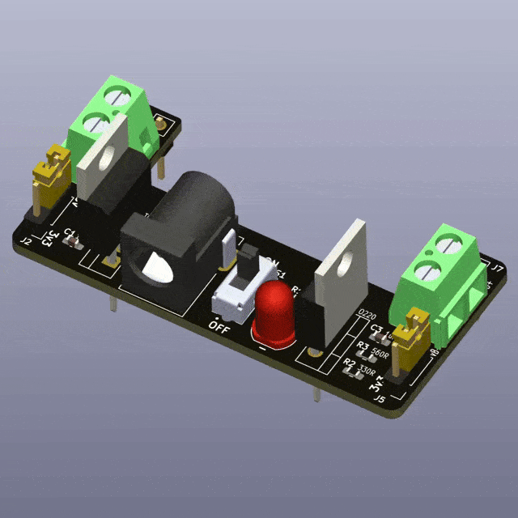
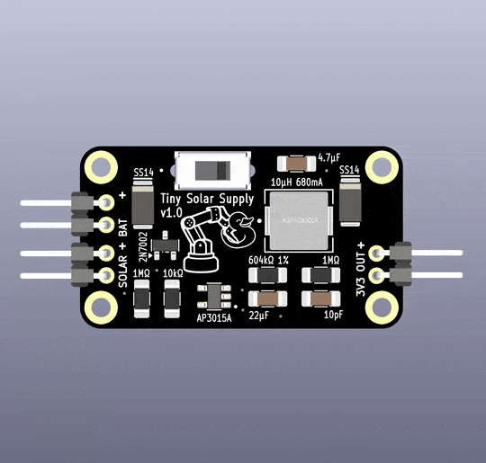
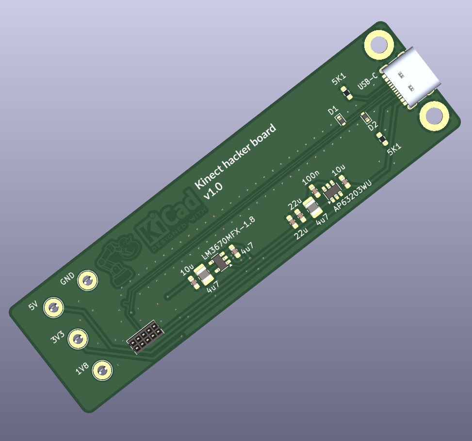
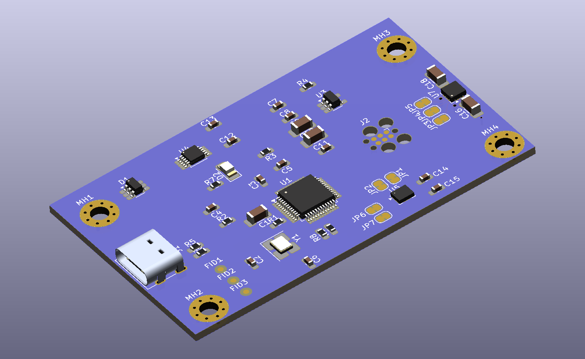
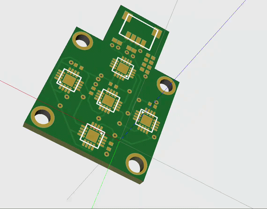

# README.md

This repository contains [my course notes](./notes/KiCAD_notes.md) from the Udemy course [KiCAD like a Pro](https://www.udemy.com/course/kicad-like-a-pro-3e/) by Dr Peter Dalmaris, as well as several beginner friendly KiCAD projects (some of which are inspired in the course)

| Image                                                        | Name                                                         | Description                                                  | Source                                                       |
| ------------------------------------------------------------ | ------------------------------------------------------------ | ------------------------------------------------------------ | ------------------------------------------------------------ |
|            | [LED Torch](./projects/01_LED_torch/)                        | First basic PBC. Project #1 from the Udemy course [KiCAD like a Pro](https://www.udemy.com/course/kicad-like-a-pro-3e/) by Dr Peter Dalmaris | [KiCAD like a Pro](https://www.udemy.com/course/kicad-like-a-pro-3e/) |
|  | [Breadboard Power Supply](./projects/02_breadboard_power_supply/) | Project #2 from the Udemy course [KiCAD like a Pro](https://www.udemy.com/course/kicad-like-a-pro-3e/) by Dr Peter Dalmaris | [KiCAD like a Pro](https://www.udemy.com/course/kicad-like-a-pro-3e/) |
|  | [Tiny Solar Supply](./projects/03_tiny_solar_supply/)        | Project #3 from the Udemy course [KiCAD like a Pro](https://www.udemy.com/course/kicad-like-a-pro-3e/) by Dr Peter Dalmaris | [KiCAD like a Pro](https://www.udemy.com/course/kicad-like-a-pro-3e/) |
|  | [MCU Datalogger](./projects/04_MCU_datalogger/)              | Project #4 from the Udemy course [KiCAD like a Pro](https://www.udemy.com/course/kicad-like-a-pro-3e/) by Dr Peter Dalmaris | [KiCAD like a Pro](https://www.udemy.com/course/kicad-like-a-pro-3e/) |
|              | [Kinect Lite](./projects/05_kinect_lite/)                    | Hacking the Kinect - inspired by a post by Weekend Robotics from 2019 on how to turn an old Kinect into a low cost and compact USB-C powered RGBD sensor | [Weekend Robotics]( https://medium.com/robotics-weekends/how-to-turn-old-kinect-into-a-compact-usb-powered-rgbd-sensor-f23d58e10eb0) and [vojtapl's Github](https://github.com/vojtapl/xbox360-kinect-lite) |
|         | [Pico IoT Thingy](./projects/06_pico_IoT_thingy/)            | Raspberry PICO IoT device on 4-layer PCB with sensors and more b- based on a YouTube tutorial by morten | [YouTube tutorial ](https://www.youtube.com/watch?v=tCulctQqdhM) by morten |
|                 | [MSPM0](./projects/07_MSPM0/)                                | Texas Instruments MSPM0-based hardware (USB, power, MCU, peripherals) based on a YouTube tutorial by Phil's Lab | [YouTube tutorial](https://www.youtube.com/watch?v=O-zNn5k5Bn4) by Phil's Lab |
|                   | [Reskin](./projects/08_reskin/)                              | 5X Reskin pressure sensor for robotics                       | [raunaqbhirangi's Github](https://github.com/raunaqbhirangi/reskin_sensor/tree/main/circuits) |

### ⚠️ Libraries included

This repository follows (mostly) [these recommendations](./notes/recommended_libraries_setup_in_KiCAD_repo.md) to facilitate that everything needed to replicate these projects travels with the repo 

### ⚠️ Git LFS Required

This repository uses [Git Large File Storage (Git LFS)](https://git-lfs.com/) to handle large files (mainly for CAD models, and zipped gerber files).

If you clone the repo without Git LFS, large files will appear as tiny pointer files instead of the real content.

### Setup
1. Install Git LFS on your system:

   ```bash
   sudo apt install git-lfs
   ```

2. Run once on your machine to set it up for your user account:
   ```bash
   git lfs install
   ```

3. Clone the repository as usual:

   ```bash
   git clone https://github.com/mhered/KiCAD_udemy_course.git
   ```
