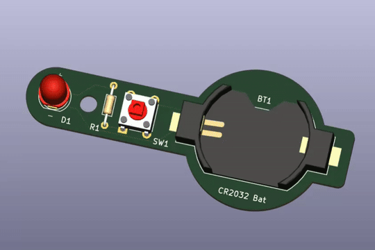

# Notes on "PCB design with KiCAD - updated for KiCAD 9"

Dr Peter Dalmaris - [PCB design with KiCad - updated for KiCad 9 | Udemy](https://www.udemy.com/course/kicad-like-a-pro-3e/)

See also [Companion book (PDF)](./assets/KiCadLikeaPro3e_Course_Companion.pdf)

## Course structure

1. Intro to PCBs: basic lessons (Sections 1-3)

2. A first basic project (Sections 4-5)
3. Fundamentals (Sections 6-9) reference for specific features  
4. projects (Sections10-12): The main course projects, increasing in difficulty, hands-on learning. 
5. Recipes (Section 13): quick reference
6. Section 14 - specific features of the newest version KiCAD 9 
7. Legacy materials (Sections 15-18)

# Course notes

The course is iterative, introducing concepts and then going through them again several times in more detail. I decided to organize my notes by themes and progressively enrich them as we cover the material more times in greater detail 

- [Elements of a PCB /Glossary of terms](./elements_of_a_PCB.md)
- [About KiCAD](./About_KiCAD.md)
- [PCB design process](PCB_design_process.md)
  - [Schematic Design Workflow](./schematic_design_workflow.md)
  - [Layout Design Workflow](layout_design_workflow.md)
  - [Manufacturing PCBs](manufacturing_PCBs.md)
- [Project 1: LED Torch](../projects/LED_torch/README.md) 

 

