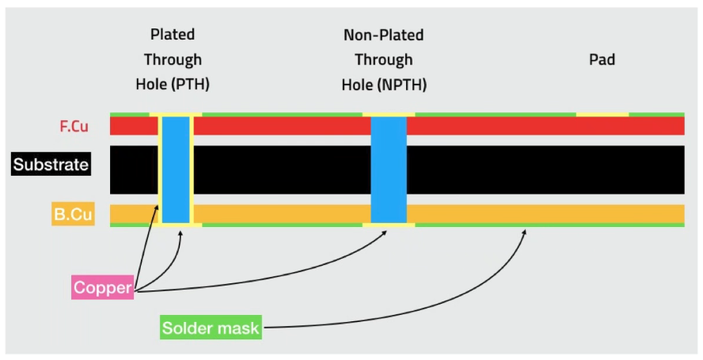
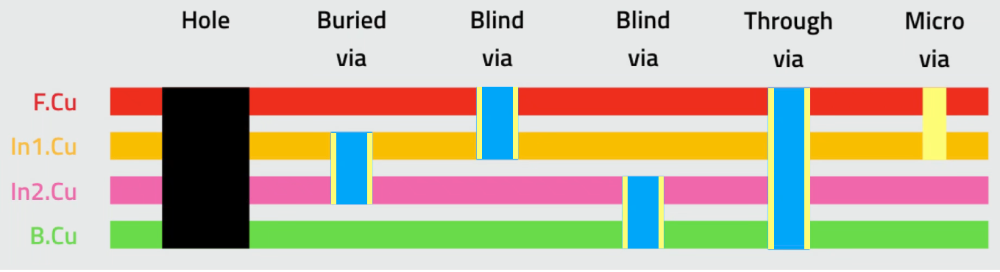
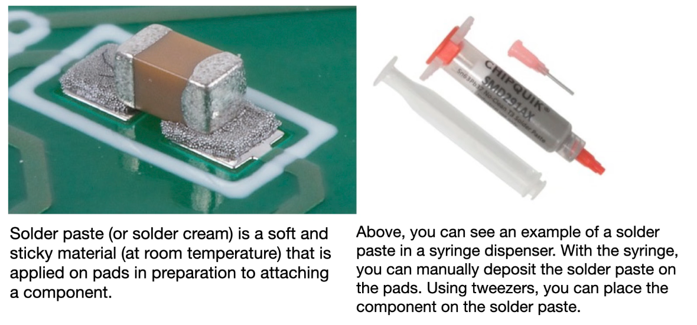

# Notes PCB design with KiCAD - updated for KiCAD 9

Dr Peter Dalmaris - [PCB design with KiCad - updated for KiCad 9 | Udemy](https://www.udemy.com/course/kicad-like-a-pro-3e/)

See also [Companion book(PDF)](./assets/KiCadLikeaPro3e_Course_Companion.pdf)

## Why KiCAD

best PCB software 

free

unlimited

active opensource community

compatible with component libraries: Ultra Librarian, SnapEDA, and KiCad, Octopart

advanced features e.g. autorouter, python extensions

continuous improvement, predictable release cycle

workflow: schematic design separated from layout design

can manufacture anywhere: exports std gerber files and many take native files

windows, linux, etc

configurable: hot keys, python API

SPICE simulator integrated to simulate

## Course structure

1. Intro to PCBs: basic lessons(1-3)

2. A first basic project (lesson 4)
3. Fundamentals (lessons 5-8) reference of for specific features  
4. projects (lessons 10-13): The main course projects, increasing in difficulty, hands-on learning. 
5. Recipes (lesson 14): 

See Section 13 for specific features of the newest version KiCAD 9 

## Elements of a PCB

* 2 type of pads to attach the components:

  * **through hole components** -> 

  * **surface mount components** or SMD -> can be smaller. Smallest ones are so small they are manufactured with robots

* **traces** or **tracks** are copper wires, take the color of the masking chemical

* **silkscreen** -> adds markings, lines and texts. Decoration or info for assembly or end user
* **vias** are holes that interconnect layers
* you can have only 2 **copper layers** or can have more layers of copper inside the pcb
* **solder mask** - chemical gives color, also prevents oxidation and makes it easier to solder components by hand, protects from shorts (to some extent) between solder pads 
* pcbs can be made of std **FR4** fiber glass. 1.6mm is std width. 
* **copper fill** large areas of copper typically connected to grounds, protect from EMI. Connected to grounf via thermal reliefs (short tracks that connect pad to copper fill) 

## PCB design process

Goal: creating the plans for a printed circuit design

should be functional, manufacturable, beautiful

need to know capabilities of your PCB manufacturer

need to understand design process and tools

procedural and iterative

Kicad is a suite of apps. Workflow:

* step 1 schematic design in **eeschema** capture info about the electrical circuit

* step 2 Layout design in **pbcnew**. physical implementation (there may be many for a given circuit). Output: geometry, features, etc

* step 3 export layout design and manufacture

in **eeschema** (schematic editor) create electrical schematics, describes the circuit selecting symbols from a library. You can also download symbols or create them in the schematic library editor

Running regular electrical rules checks helps avoid mistakes early. There's a built in checker 

Need to associate symbols with layout footprints. Often the association is already made but often you need to do it

After schematic and footprint associations we start layout design in the editor **pcbnew**: position the footprints on the sheet and connect them using wires, add an outline of the PCB, mounting holes, logos, text, etc

**pcbnew** also has a design rules checker e.g. overlapping footprints, minimum distances etc

symbol in schematic represents the function of a component, not physical appearance or final location in the PCB

footprint is graphical depiction of a real component in the layout: size and location. 

e.g. a resistor has a symbol but can be implemented with a TH or SMD component of different sizes.

export in format compatible with manufacturing. Gerber files: one per layer, contain instructions, exported from Kicad

## Manufacturing PCBs

Options:

1. Chemical etching - not recommended: laborious, toxic chemicals, requires ventilation
2. Use online manufacturers: PCBWay NextPCB, Oshpark, WellPCB

2 layers is the minimum

Oshpask is good for beginners. Many more options in PCBway 

gerber file format is defined by company: https://ucamco.com

there's been some updates (x2 and x3)

Kicad supports x2

gerber are text files, human-readable

can be imported to Kicad gerber viewer to inspect them

good source for info on gerber extensions: https://www.candorind.com/gerber-file-extensions/

## Overview of KiCAD with an example project 

Official Kicad repo: https://gitlab.com/kicad

in the code, demos directory:

https://gitlab.com/kicad/code/kicad/-/tree/master/demos?ref_type=heads

probably demos folder already in your computer (in Windows: C:\Users\meheredia\AppData\Local\Programs\KiCad\9.0\share\kicad\demos) . 

We choose `pic_programmer.kicad`

https://gitlab.com/kicad/code/kicad/-/tree/master/demos/pic_programmer?ref_type=heads

3 files (text files, human readable)

`kicad_pro` -> project

`kicad_pcb` -> layout info

`kicad_ kicad_sch` -> schematic info

Can open each file individually, better to open the project as a whole opening the `kicad_pro` file or drag and drop

with project open, launch schematic editor with the button or double clicking on the `kicad_sch` file

### Schematic editor

Controls: 

* mouse wheel to zoom
* centre button pressed to pan
* double-click on symbol to bring its properties, association with a footprint, unique ID etc
  can check/uncheck features eg to disable footprint values

Can have nested schematics sheets. 

left pane: Hierarchy Navigator to see sheets, Properties manager shows properties without double clicking on components

can go to PCB editor from main window or from green button in schematics editor window

### PCB editor

On right appearance pane

on left properties manager

there are preset views, selection filters to help with targeting

### 3D viewer

If I click on a component on one editor the other editor moves to the same component

explore the web: made with kicad https://www.kicad.org/made-with-kicad/

### About...

copy version information to repost issues

### Preferences

Common settings and preferences for different apps are together

### File 

Archive/Unarchive to bundle on a ZIP file

Can also import projects from other apps

### View

Text Editor -> everything is a text file. Can also right click 

### Tools

can open apps in project manager or in this menu

## Tour of the Apps

### Schematic Editor

Wires: green lines of named labels

Components

Symbols: the big boxes representing microcontrollers?

### PCB editor

### 3d viewer

specially useful for I/O elements e.g. pins

### Symbol editor

allows to edit and save symbols or create them from scratch

### Footprint editor

to save or edit footprints 

left pane gives you access to the library

has also a **footprint wizard** that uses a generator

### Gerber viewer

allows inspecting the PCB before uploading for manufacturign

Its a Q control tool

### Image converter

allows taking a bitmap and convert it into a footprint to decorate the PCB

### Calculator tools

e.g. track width  go to recipe part

### Drawing sheet editor

to edit the drawings

also dedicated lecture

### Plugin manager

## Preferences -> configure paths

2+1 important paths: symbols, footprints and 3dmodels

Also templates and custom templates folders 

you can alter defaults changing the environment variables, because they take a lot of space specially the 3d models. May want to put them on an external USB HD

Symbols libraries, Footprint libraries etc apparently you can define a project path via environment variables

## Create a new project from scratch

**File** > **New Project** select location, give it a name, click on create a new project folder

Automatically creates stubs for: 

`kicad_pro` -> project

`kicad_pcb` -> layout info

`kicad_ kicad_sch` -> schematic info

can be inspected with the text editor

## Create a new project from a template

**File** > **New Project from Template**

There are Raspberry Pi HAT templates!

Can also make your own templates

Creates a project already prepopulated with certain things

## Design Workflows

Two 7-step workflows. In reality not linear but iterative.

## Project 1: LED Torch 

### Schematic Design

#### 1. Setup

Preferences > Common > Configure automatic backups

Preferences > Schematic Editor > Grids

Configure view using buttons in left hand (type of cursor, snap to grid, units etc)

#### 2. Symbols

`a`  to bring symbol chooser

Select, place

`r`to rotate

#### 3. Arrange annotate associate

Since KiCAD8 annotation is automated (unique identifiers)

Arranging. 

3 options to fix a symbol:

1. delete and add again 
2. double click to bring **Properties** window + **Change Symbols** button which also allows to change symbols in bulk

Assign footprint. Can do with double click + properties window but better with 

**Assign Footprints**. Filter by library and pin count,  symbol footprint is unreliable.

Filters are no perfect

#### 4. Wire

**Draw Wires** tool or `w` to connect pins with wires 

then **Electrical Rules Checker** > **Run ERC** throws warnings if wires not on grid. Can click an drag

Also complains only used one unit of the switch 

#### 5. Nets

a net is a name for a connection, can have several wires. Can be named .

#### 6. Electrical Rules Check

**Delete All Markers** when done

#### 7. Comments

### Layout design 

#### 1. Setup

Import footprints with **Update PCB from Schematic** button

Open **Appearance** pane, there you can select the active layer to draw tracks ej. **F.Bu** for top,  **B.Cu** for bottom copper layer or **Edge.Cuts** for PCB outline. 

Selection filter defines what is selectable by type (ej. text or footprints)

Objects allow defining visibility by type

#### 2. Outline and constraints

Constraints:  minimal size for cost, consider attachment, access to connection or switches, biggest component, etc

#### 3. Footprints

Distribute footprints

#### 4. Route

Set number of copper layers

Start routing from left to right

#### 5. Silkscreen

Can move things from Fabrication layer to Silkscreen layer

#### 6. Design Rules check

check parity as well

#### 7. Export & Manufacture

2 methods:

- Plugin (easier)
- gerber files: plot + generate drill files, the zip and upload

#### 8. (BONUS) Exporting 3D including silkscreen

YT video: https://www.youtube.com/watch?v=Q_API66fq4I

trick that uses exporting to STEP + manually copying the silkscreen as an image

# Design principles

## Schematic symbols

American Std IEEE (or _US in KiCAD libraries)

European IEC 

Commit to one std!

This seems a good resource: https://www.raypcb.com/electronic-circuit-symbols/

See also: [IEEE standard (PDF)](./assets/ansii_graphic_symbols_for_electrical_and_electronics_diagrams_1993.pdf)

##  PCB materials

FR4 most common, multilayer: fiberglass epoxy composite, FR means flame retardant

Other materials:

- CEM-1, FR-1, FR-2: paper based, cheaper less durable and lower TG, 1 layer
- CEM-3: cheaper but less durable, 1-2 layers
- Polyimide: high TG, flexible
- PTFE (Teflon): RF, microwave, radar, 5G good for HF, very low dielectric loss
- Aluminium or Copper: rigid, thermal conductivity: high power

| Material      | Resin Type          | Tg (°C)     | Layer Support    | Use Cases                                   |
| ------------- | ------------------- | ----------- | ---------------- | ------------------------------------------- |
| FR-4          | Epoxy               | 130–180     | 1–Multilayer     | General electronics, industrial, automotive |
| CEM-1 / CEM-3 | Epoxy (paper/glass) | 110–130     | 1–2 layers       | Low-cost consumer products                  |
| FR-1 / FR-2   | Phenolic (PF)       | ~105        | 1 layer only     | Toys, clocks, basic gadgets                 |
| Polyimide     | Polyimide           | >200        | Flexible & rigid | Aerospace, flex PCBs, high-temp apps        |
| PTFE (Teflon) | PTFE                | 160–280     | Multilayer       | RF/microwave, satellite, 5G systems         |
| Flex (PI/PET) | Polyimide or PET    | >200 / <100 | Flexible         | Wearables, foldables, cameras               |
| MCPCB         | Varies (Al/Cu core) | High        | 1–2 layers       | LEDs, power supplies, thermal management    |

## Traces or tracks

Connect the pads

made of copper 

we can control width, height, and route

Take the color of the solder mask

## Keep-out areas

can be marked on one or all layers or faces. E.g. to prevent interferance with an antenna, provide user access, install a screen etc

## Pads and holes

2 types: 

TH through hole pads connect electrically front and back

SMD surface mounted pads exist on a single layer. Most common in industry, allow smaller components installed automatically

round, rectangular or oval

## Vias

hole with inside plated with copper. They are smaller so component pins don't fit and have no pad so you cannot solder components

can be through, blind, or buried. micro vias are made with laser.

## Annular ring

width is the minimum distance between hole edge and pad edge. If drill is not centered there can be a tangency or even a breakout

## Solder mask

thin layer of polymer that prevents oxidation and solder bridges between pads

## Silkscreen

useful information and also style

## Drill bit and drill hit

drill bits typically .3, .6, 1.2mm guided by CNC 

For very small holes (e.g. micro vias) made with laser

drill hit: location where the drill contacts the PCB and makes a hole

## Surface mounted device

allow manufacturing cheaper smaller PCBs (automatic assy)

## Gold fingers

gold plated connectors at the edge of a PCB 

Allow connecting a PCB to a slot

## Panel

PCBs are manufactured in large panels 

then populated with Pick and Place machine

then cut, leaving break away points

## Solder past and paste stencil

At large scale the paste is applied with a stainless steel component

Can buy reflow ovens to install smd components at home

## Pick and place machine

