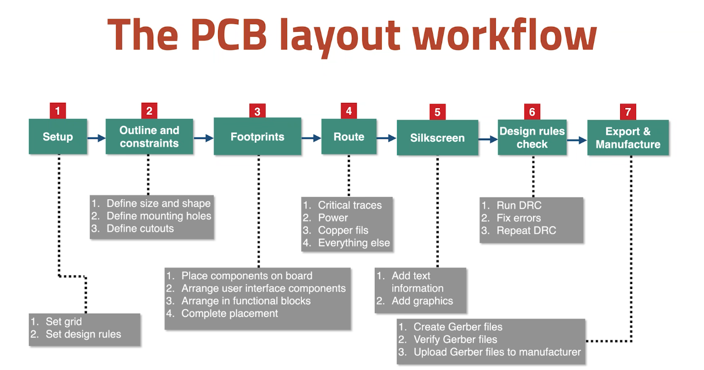

# Layout Design Workflow

## 1. Setup

**Preferences** > **Preferences** > **PCB Editor** > **Grids** 

Set grid sizes (main, grid 1 (`Alt` +`1`) grid 2 (`Alt` + `2`) ) or **Grid Override**

**File** > **Board Setup** >

* **Physical stackup**:  Number of layers: typically 2 are enough

  Manufacturers will always consider 2 layers. Use them! This facilitates component placing and trace routing. Also allow for a ground plane e.g. useful in motor controllers, EMI protection. 2 layers are much cheaper than multilayer boards

* **Design rules** > **Constraints** depend on project requirements and compatibility with your manufacturing capabilities

Import footprints with **Update PCB from Schematic** button (1) or `F8`

Open **Appearance** pane (2), there you can select the active layer to draw tracks ej. **top_layer** for top,  **bottom_layer** for bottom copper layer or **Edge.Cuts** for PCB outline. 

**Selection filter** (3) defines what is selectable by type (ej. text or footprints)

**Objects** (4) allow defining visibility by type

## 2. Outline and constraints

Good practice to start with the board outline

keep it rectangular unless there's a good reason (optimal use of material, lots of edges for interfacing). Can do irregular shapes if needed. 

Constraints:  

* minimal size for cost, 
* consider attachment to the box: mounting holes? snap-on?
* geometrical constraints e.g. align connectors

Two ways to implement mounting holes: pad or outline (**Edge.Cuts** layer)

Consider also heat distribution: transistors, voltage regulators, integrated circuit boards. Consider space for heat sinks, alignment with hole in box or ventilation system. Datasheets often have recommendations for heat dissipation.

## 3. Place Footprints

Distribute footprints inside the outline. Consider:

* good access to user interfaces (connectors, switches, etc) near the edges
* biggest component, etc

Rules:

* try to untangle rats nests
* place related components together 
* minimize length of traces 
* consider assembly capabilities: e.g. leave space for soldering
* consider component specs: leave space around components which emit heat e.g. power transistors, or components which require external heat sinks 

## 4. Routing

Drawing traces between pads. 

* start with critical traces e.g. signal traces with specific shape and length requirements such as an onboard antenna, may also require a keep out zone
* then power traces: distribute power, carry higher current. should be wider than signal traces. For low voltage/low power PCBs: 0.30 -0.40 mm. See recipe for width calculation
* the rest of the traces

Consider **copper fills / copper pours**: areas of board fully covered with copper, typically ground plane (continuous mass of copper connected to electrical ground or battery -)  and copper plates connected to a + or - level of voltage. Connect pads to the field with thermal reliefs (short traces). This facilitates soldering to the pad (otherwise the field dissipates the heat). 

Benefits:

* Offer a degree of protection vs EMI
* help dissipate heat
* enforce discipline: signal traces on top layer, connect all ground pads to bottom layer through vias 

Start routing from left to right

Design considerations for traces

* length: keep them short: more length generates heat, and increase propagation time (important in high freq and data buses). Kicad has tools that allow setting a specific length
* only 45deg angles: avoid sharp angles (may cause reflections and radio interferences specially at 200MHz and above)
* PCB thickness: std is 1.6mm. Range from ultra thin 0.4mm to very thick 2.4mm (structural role)
* copper weight: std is 1 ounce  Cu / sq foot) ~300g/m2. More expensive but better perfo. 
* trace width: good practice for power traces
* proximity: separate traces (>0.15mm for manufacturability but also operation to avoid cross talk interference in high freq)

## 5. Silkscreen

On top layer (**F.SilkS**) or bottom (**B.SilkS**) layers 

Can move things from Fabrication layer to Silkscreen layer

* descriptions of pads
* name and version of the board
* logo or graphics, contact info
* instructions for component assembly or the end user: e.g. names models and values of components

There is no automatic test, check manually!

## 6. Design Rules check

check regularly and at least every time a mayor trace or copper fill is complete 

check parity as well

Some warnings can be ignored

## 7. Export & Manufacture

2 methods:

- export gerber files: plot + generate drill files, the zip and upload. **Do not forget the drill files!!**
- use Plugin (easier)
- some providers allow uploading directly a `.kicad_pcb`

## (BONUS) Exporting 3D including silkscreen

YT video: https://www.youtube.com/watch?v=Q_API66fq4I

trick that uses exporting to STEP + manually copying the silkscreen as an image