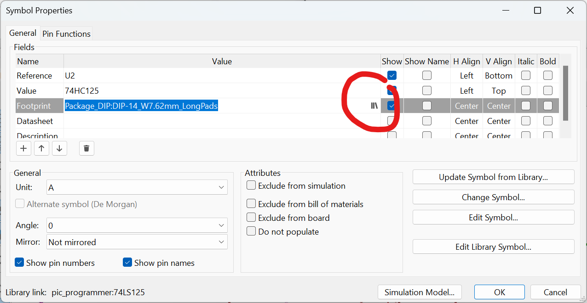

# Schematic Design Workflow

## 1. Setup

## Configure auto backups

**Preferences** > **Preferences** > **Common** > **Configure automatic backups**

### Configure grid size

**Preferences** > **Preferences** > **Schematic Editor** > **Grids**

### Configure page

**File** > **Page Settings...**

### Configure view 

using buttons on left (type of cursor, snap to grid, units etc)

## 2. Symbols

Symbols in schematic represent the function of a component, not its physical appearance or final location in the PCB

Press `a` to bring up **symbol chooser**

Select symbol, place it, 

may create symbols and libraries or import them

## 3. Arrange Annotate Associate

Since KiCAD8 **annotation** is automated (unique identifiers)

**Arranging**. move symbols, `r`to rotate

3 options to fix a symbol added by mistake:

1. delete and add again 
2. **Double-click** on symbol > in **Properties** window > **Change Symbols** button which also allows to change symbols in bulk

**Assign footprint**:

* **Double-click** on symbol > in **Properties** window >Click on the library symbol on the **Footprint** 

* but better with **Assign Footprints**. Filter by library and pin count,  symbol footprint is unreliable.

Filters are not perfect

## 4. Wire

**Draw Wires** tool or `w` to connect pins with wires 

then **Electrical Rules Checker** > **Run ERC** throws warnings if wires not on grid. Can click an drag

Also complains only used one unit of the switch 

## 5. Nets

a net is a name for a connection, can have several wires. 

Can be named manually (or by default by KiCAD)

Net tags typically used for: power nets (ground and 5V, thicker wires), and antennas, data or address buses where geometry is important. Making them descriptive (like programming variables!) helps later in **pcbnew**

## 6. Electrical Rules Check

Check regularly for design errors: unconnected pins, problems with power pins, incompatible pins etc

ERC can be customized, not necessary

**Delete All Markers** when done

## 7. Comments & Graphics

Worth commenting in non trivial PCB designs 

Graphics: lines and boxes