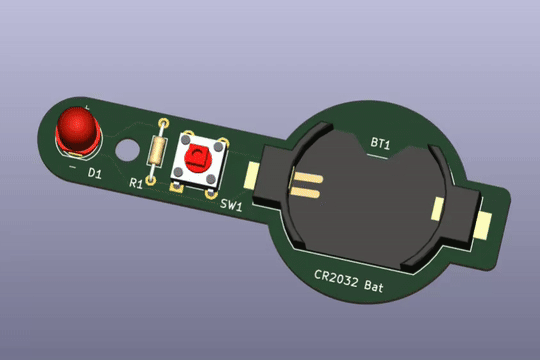
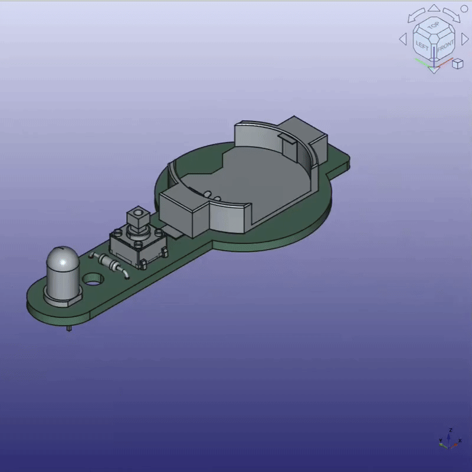
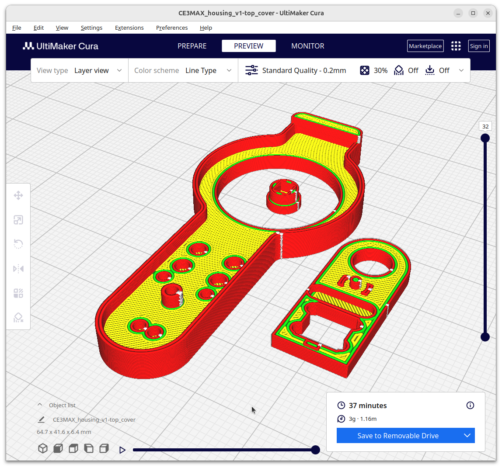

# README.md

## LED_torch - a first basic PCB project 

## Designing the covers

make it clip snuggly while allowing for tolerances, (especially on the soldered components) is fun

## 3D printing the covers