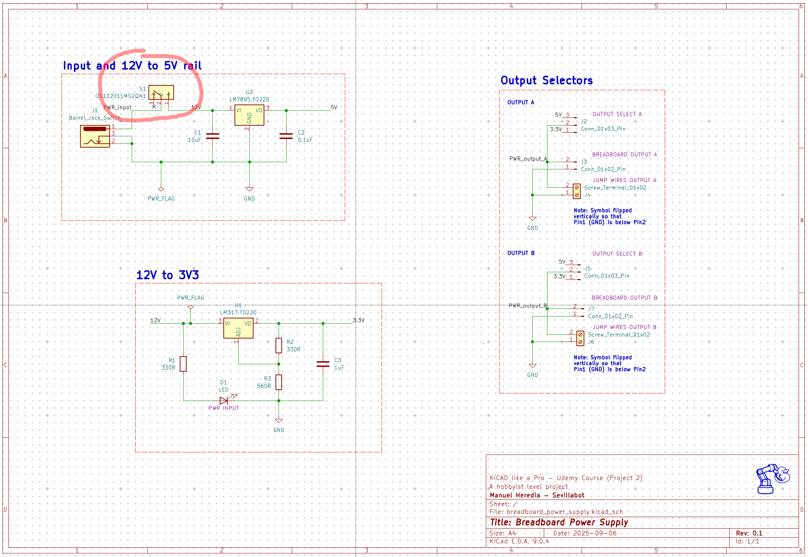
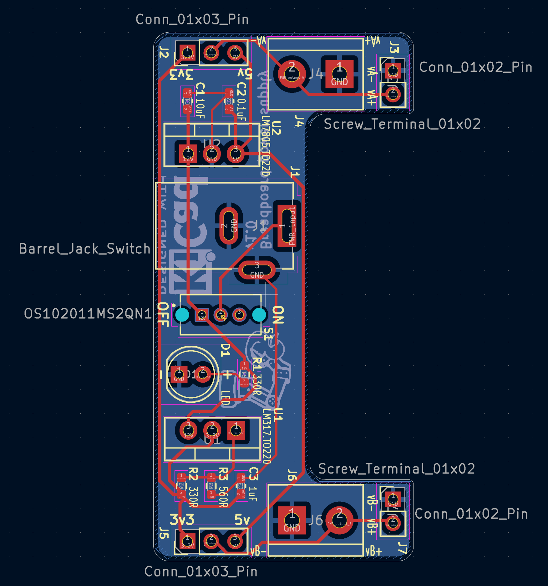
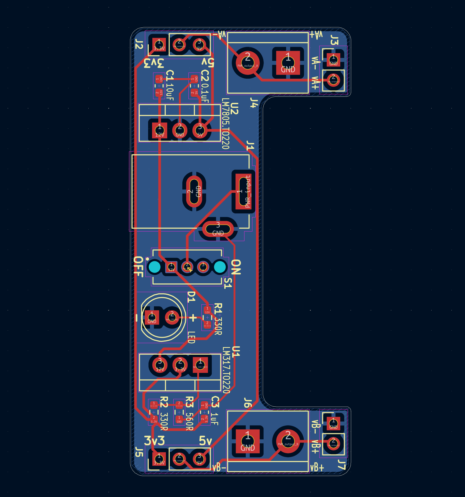
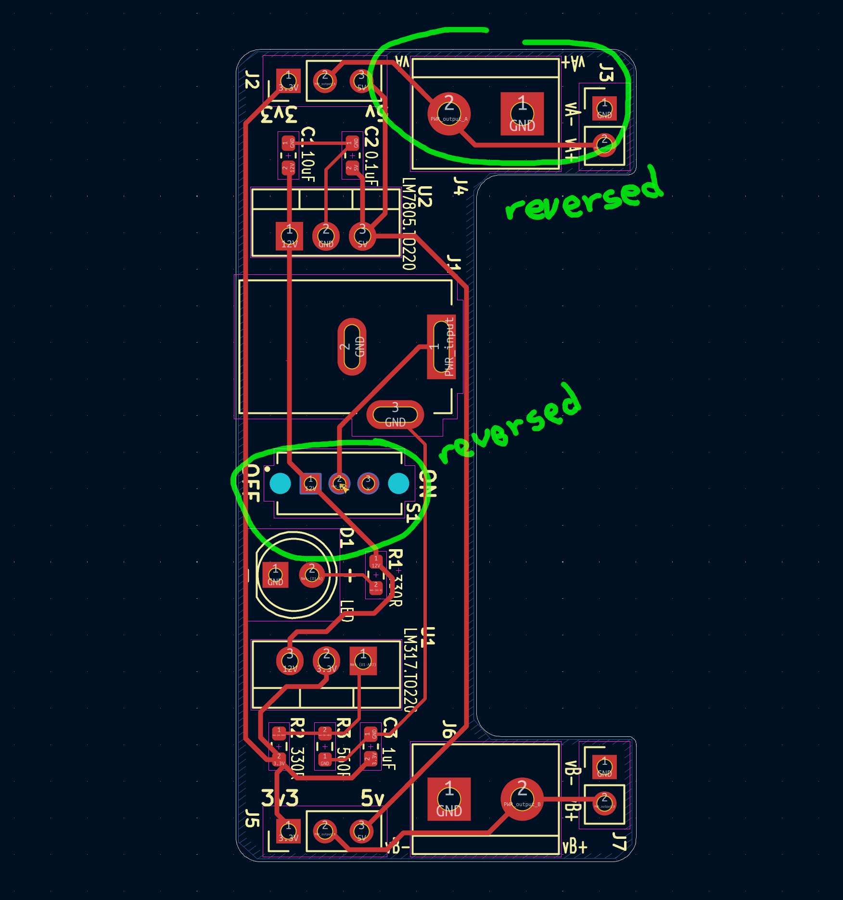
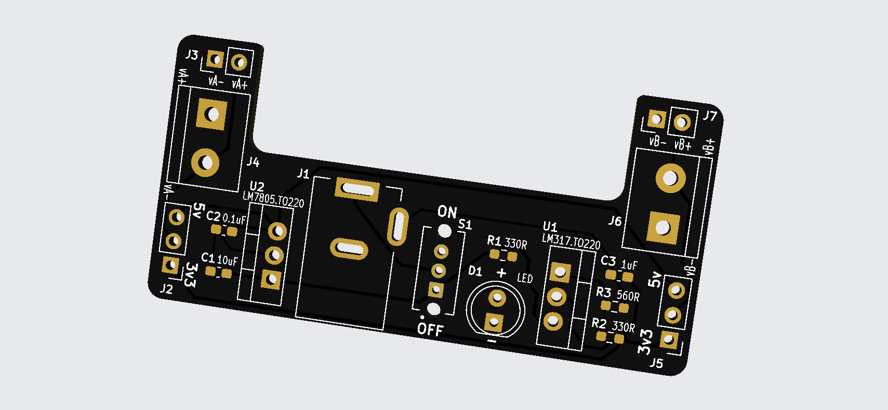
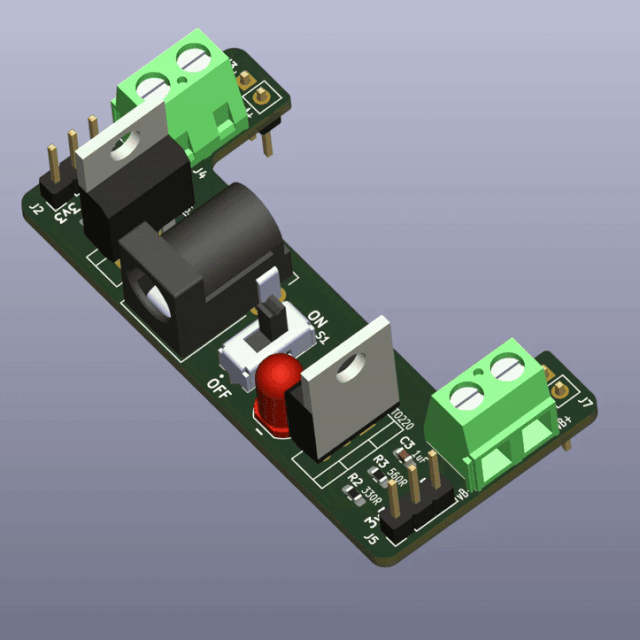
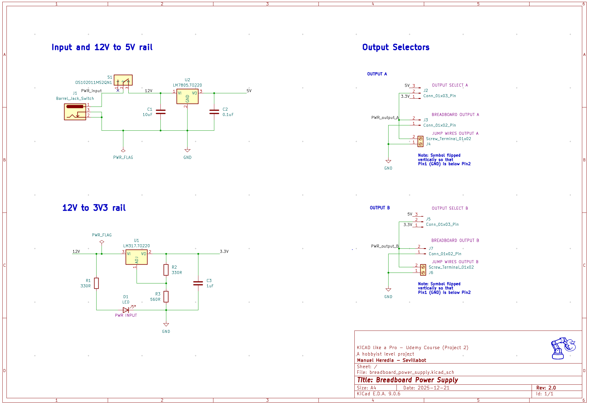
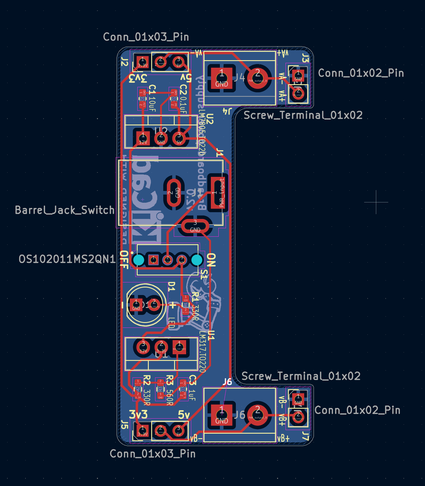
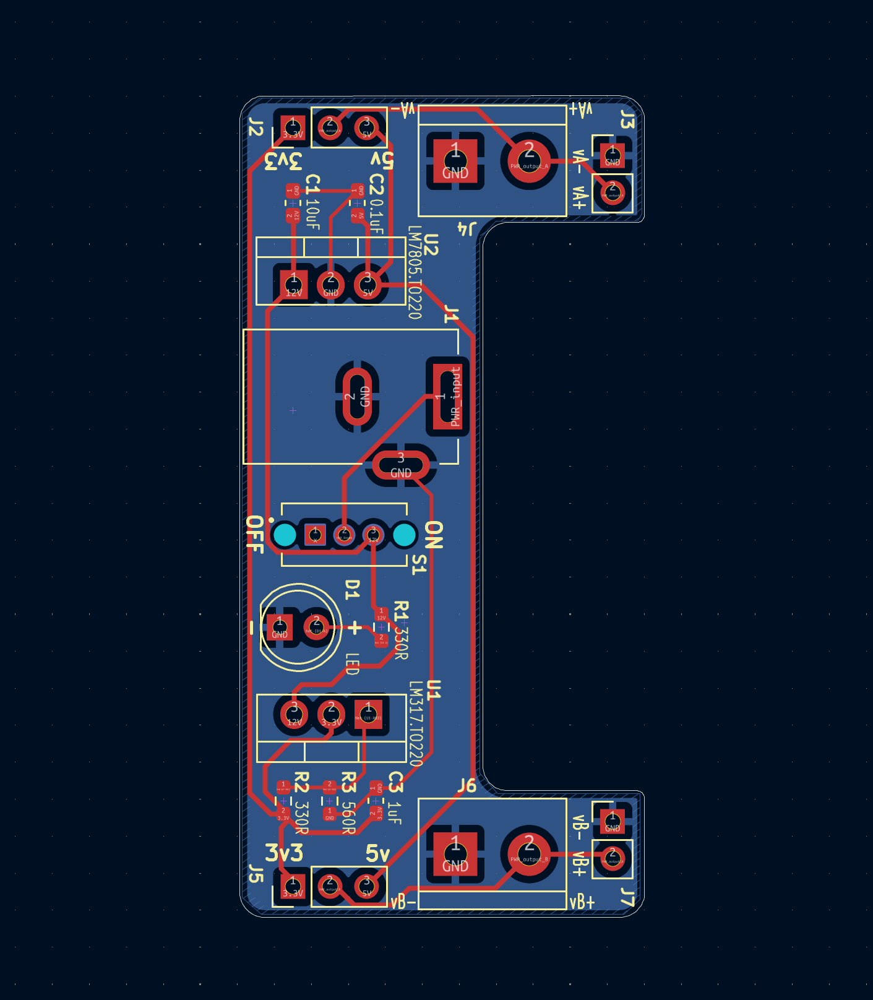
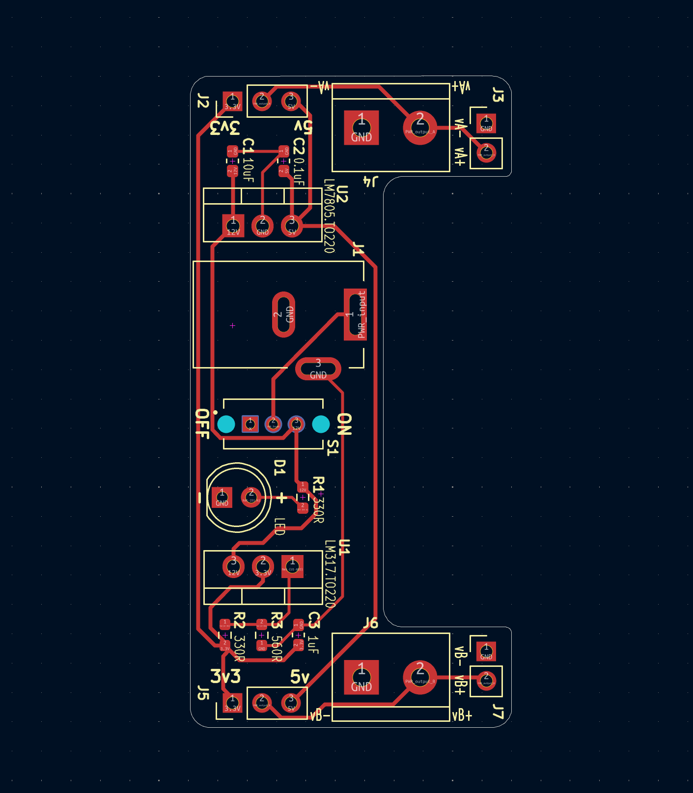

# README.md

## Breadboard Power supply v1

v1 designed Sept'25, built Dec'25 had two errors:

- Switch S1 was flipped (so **OFF** was **ON** and vice versa)
- J4 Screw Terminal was flipped (so **vA+** was **vA-** and vice versa)

### Schematics

### Layout

| All layers                          | Front Silkscreen, Front and Back Copper layers | Front Silkscreen and Front Cu layer |
| ----------------------------------- | ---------------------------------------------- | ----------------------------------- |
|  |          |   |

### 3D

## Breadboard Power supply v2

Changes in v2 (Dec'25):

- fix errors:
  - flip Switch S1 (so OFF and ON work as intended)
  - flip J4 Screw Terminal (so vA+ and vA- are as intended)
- update schematics:
  - improve readability
  - update version number to v2.0
- update silkscreen:
  - Update version number in back silkscreen to v2.0
  - fix footprint of J4 screw terminal in front silkscreen
- update 3D view: 
  - color mask black
  - add jumpers

### Schematics

### Layout

| All layers                          | Front Silkscreen, Front and Back Copper layers | Front Silkscreen and Front Cu layer |
| ----------------------------------- | ---------------------------------------------- | ----------------------------------- |
|  |          |   |

### 3D

