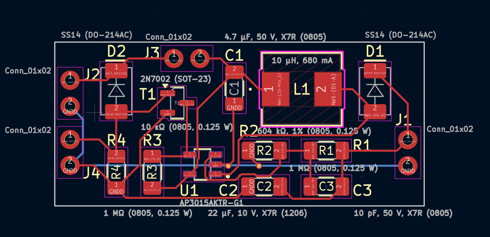
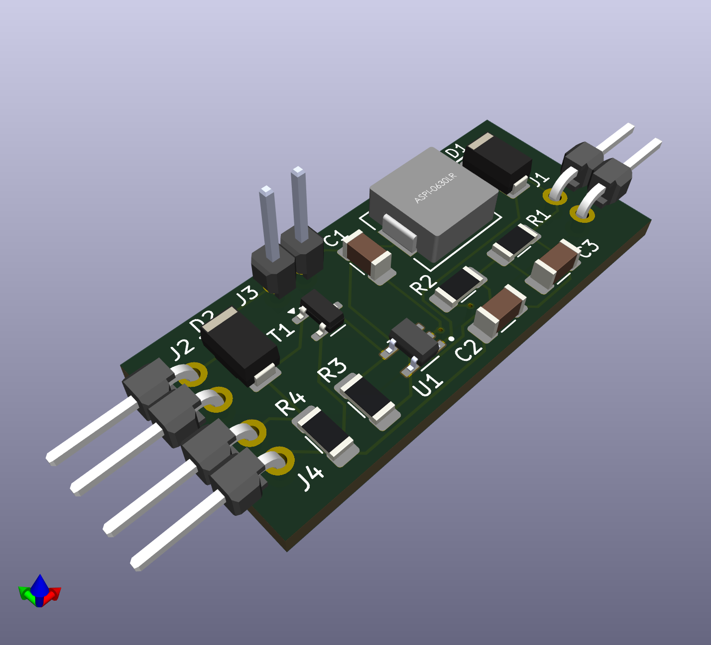
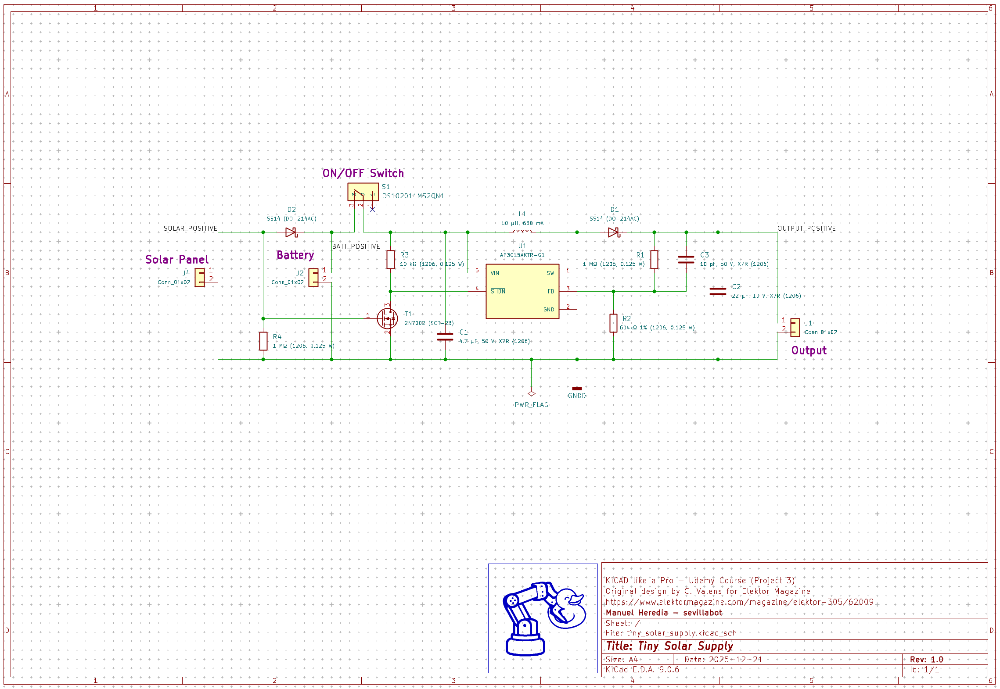
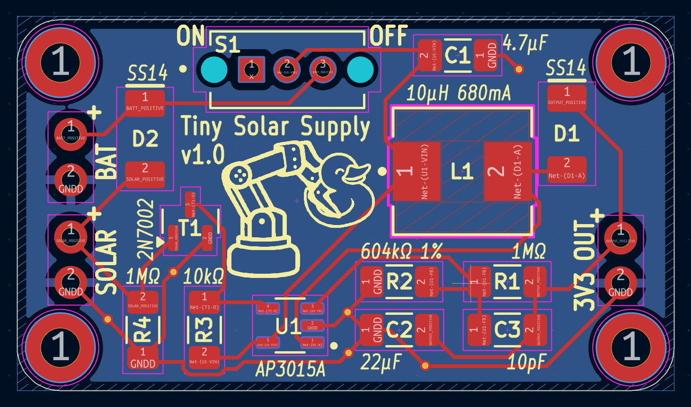

# README.md

Inspired by [this Elektor article](https://www.elektormagazine.com/magazine/elektor-305/62009) (see [PDF version](./assets/220321-01_Tiny_Solar_Supply.pdf)) and its companion [Elektor  Lab](https://www.elektormagazine.com/labs/tiny-solar-supply), from where attachments can be downloaded:

* BOM: [220321-solar-supply-bom-v1.0.xlsx](./assets/downloaded/220321-solar-supply-bom-v1.0.xlsx)
* gerbers: [220321-1-v1.0-gerber.zip](./assets/downloaded/)
* kicad files: [220321-solar-supply-v1.0-kicad5.zip](./assets/downloaded/)

## BOM

**Resistors (0805, 0.125 W)**

R1, R4 = 1 MΩ

R2 = 604 kΩ, 1% >> Note: take care of high precision

R3 = 10 kΩ

**Capacitors** 

C1 = 4.7 µF, 50 V, X7R (0805) >> X7R is general purpose ceramic capacitor

C2 = 22 µF, 10 V, X7R (1206)

C3 = 10 pF, 50 V, X7R (0805)

 **Inductors**

L1 = 10 µH, 680 mA

 **Semiconductors** 

D1, D2 = SS14 (DO-214AC) >> Shottky

IC1* = AP3015 or AP3015A 

T1 = 2N7002 (SOT-23) >> MOSFET

 **Miscellaneous** 

K1, K2, K3 = pin header, 1 row, 2 contacts, 2.54 mm pitch

K4 = pin header, 1 row, 2 contacts, right-angle, 2 mm pitch

(* Note: The AP3015 micropower step-up DC/DC converter from Diodes, Inc. IC1 is the heart of the circuit. There's a choice between the A-version, which works with input voltages as low as 1 V (and up to 12 V) and can deliver 100 mA, and the non-A version, which starts at 1.2 V, but can supply up to 350 mA)

## v0.1 Sept'25

## v1.0 Dec'25

- replace 0805 packages for 1206s
- replace jumper J3 for slide switch S1 for ON/OFF
- improve silkscreen

## v1.1

* inductor L1 not the one I ordered:
  * Order ABRACON ASPI-0630LR-100M-T15 (LCSC# C1334133) current 4A matches footprint used
  * Alternatively order CDRH4D22NP-100NC (LCSC# C2453957) closer to the one specified in A3015 datasheet AND replace footprint
* improvements in routing (direct connections to ground plane)
* Improve silkscreen: white bkg for user labels, fix ON / OFF switch labels (were reversed)

To do:

- [ ] decision on L1
- [ ] ground mounting pads
- [ ] replace 

by mounting pads with vias (cooler!)
