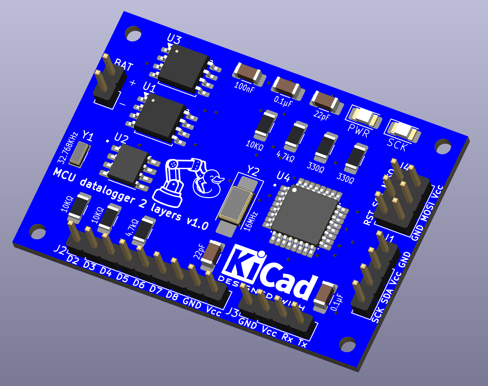
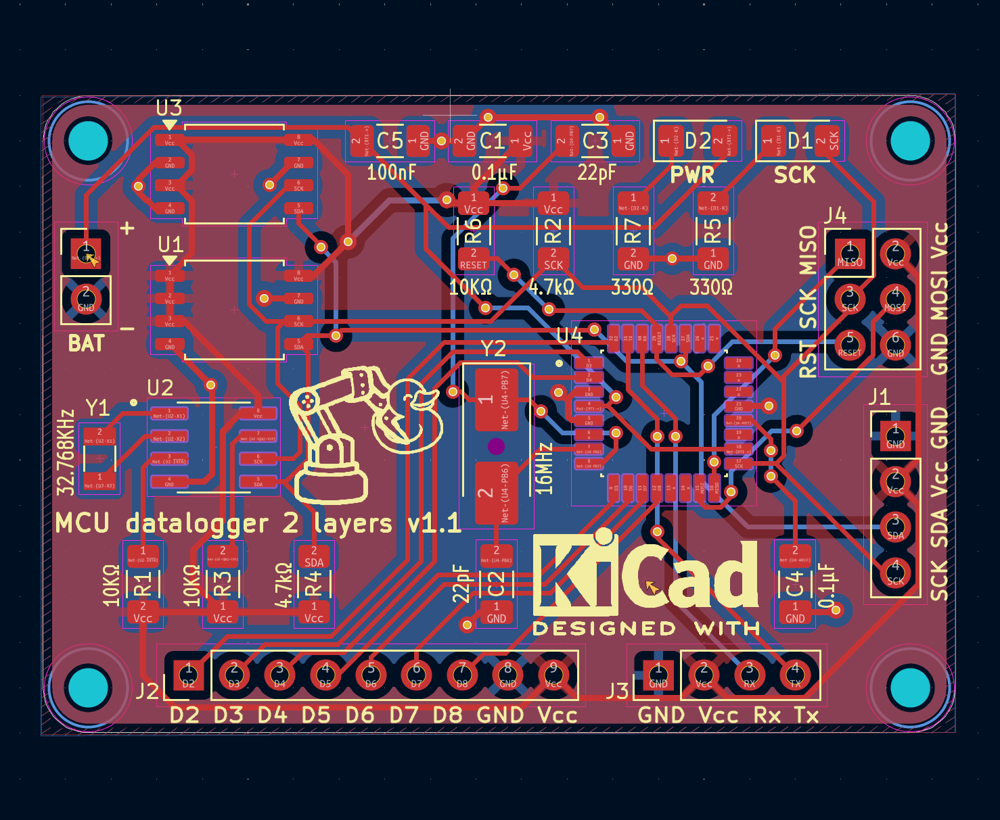
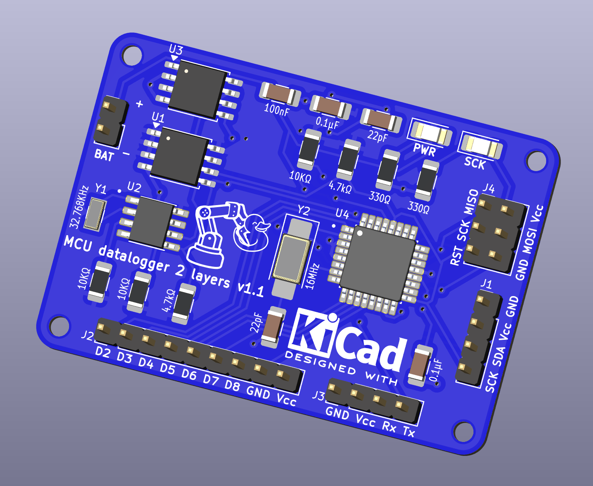
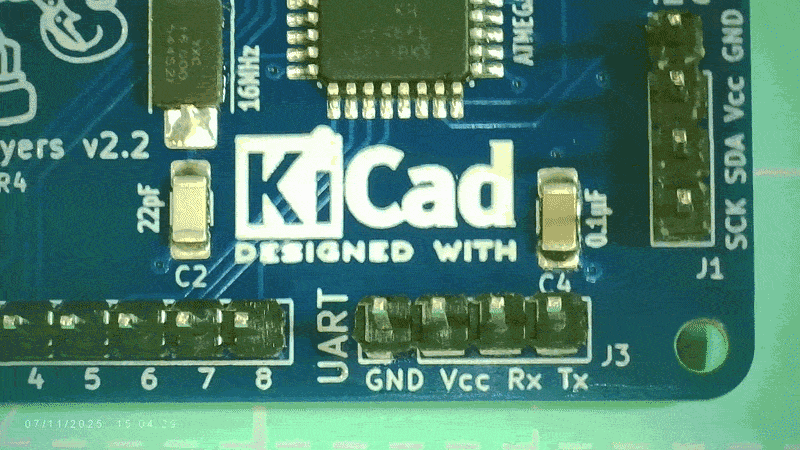
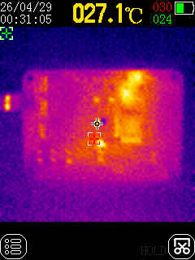
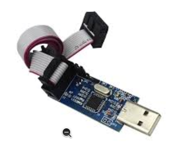
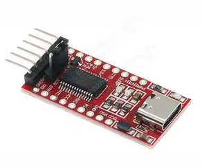

# README.md

A simple **microcontroller-based datalogger** designed to practice PCB design in KiCAD while introducing the fundamentals of embedded data acquisition. The board reads sensor data through the MCU and stores it in EEPROM, making it possible to log measurements over time.

The design covers the key building blocks of a typical datalogger system:

- **MCU (microcontroller)** – handles sensor interfacing, data collection, and storage management. **ATMEGA328P-AU** (downloaded from SNAPEDA)
- **DS1337S** - Real-time clock
- **Sensors / Inputs** – generic sensor connections to capture physical measurements.
- **EEPROM** – nonvolatile memory to store logged data.
- **Power supply** – provides stable operation from external power or batteries (expected 3.3V-5V. Supplies both RTC and MCU)
- **Programming / Debug headers** – for uploading firmware and retrieving logged data (??)


## v1.0



## v1.1

Adjust edges and silkscreen, add Vcc fill zone





## Bootloading and firmware uploading the ATMEGA328

- Arduino to atmega328 [Arduino Uno to ATmega328 - Shrinking your Arduino ProjectsYouTube · DroneBot Workshop29 Dec 2018](https://www.youtube.com/watch?v=Sww1mek5rHU)
- Shrinking arduino projects atmega328 https://youtu.be/aex1HFhJG_g?si=vZYHLi1vfadTmJW0

- http://www.kerrywong.com/2010/09/25/i2c-data-logger-using-atmega328p-and-ds3232/

## v1.2 and v2.2

These are the first versions I printed 

## v1.3

Note: ChatGPT disagrees with the choice of an electrolytic 100nF capacitor in parallel with the battery it says it is too slow. and recommends instead a ceramic 100nF close to the MCU pins to act as filter for spikes. Optionally can add a 10-100uF bulk cap (e.g. electrolytic) to stabilize). I cant find anything in the datasheet

Note: Looks like EEPROM address is hardcoded 111 and 101, check datasheet!

Cleaned up the schematic with what I have learned since I first made it. In `MCU_datalogger.kicad_sch` and `connectors.kicad_sch`:
   - updated RTC, EEPROM, Crystal symbols to arrange pins properly and align them to the 100mil grid
    - renamed nets to start with `ICSP_*`,  `I2C_*`,  `UART_*`
    - replaced `Vcc` label with the `VCC` power symbol
    - added net colors

In `MCU_datalogger.kicad_pcb`:
- replaced layout in `main` branch with empty placeholder referring to `2layer` and `4layer` branches

To do:
- [ ] ensure modified symbols are saved in custom library (e.g. MH_library)
- [ ] Note: before deleting the layout DRC threw hundreds of errors: unconnected pins, solder mask bridges, etc. Find out why and fix it smartly.

# Assembly

To do:

- [ ] download videos from iphone, cut video of STM assy, including BOM screencast

# Inspect

 


# Power on

1. Power on connecting 5V to BAT input and check ther is no magic smoke and temperatures are normal



# USBasp vs FT232

| Device  |                           | Talks To            | Used For                                                     |
| ------- | ------------------------- | ------------------- | ------------------------------------------------------------ |
| USBasp  |   | Hardware SPI        | Install bootloader on blank chip, recover bricked chip, reset fuses. Can be used to upload sketch in production |
| FT232rl |  | Bootloader via UART | Upload sketches easily when bootloader is installed. Good for faster iteration during development |

## Burn the bootloader

1. Connect the **USBasp** to the ICSP port in the PCB and to the computer USB

### Option 1 - use A**rduino IDE**:

* **Tools** >  **Board** > **Arduino Uno**
* **Tools** > **Programmer** > **USBasp**
* **Tools** > **Burn Bootloader**

This will set fuses, install Optiboot and configure the clock source

⚠️ Note: in my case this yields error: `cannot set SCK period; please check for USBasp firmware update`

### Setup (first time) - Give permission

If `Warning: cannot open USB device: Permission denied` when trying to burn the bootloader 

1. Check the ATMega is recognized

```bash
$ lsusb
...
Bus 003 Device 031: ID 16c0:05dc Van Ooijen Technische Informatica shared ID for use with libusb
...

```

2. Create an udev rule file for USBasp

```bash
$ sudo nano /etc/udev/rules.d/99-usbasp.rules
```

with this content:

```
SUBSYSTEM=="usb", ATTR{idVendor}=="16c0", ATTR{idProduct}=="05dc", MODE="0666"
```

3. Reload udev rules

```bash
$ sudo udevadm control --reload-rules
$ sudo udevadm trigger
```

### Option 2 use `avrdude`

```bash
$ sudo apt install avrdude
$ avrdude -c usbasp -p m328p -v

avrdude: Version 7.1
         Copyright the AVRDUDE authors;
         see https://github.com/avrdudes/avrdude/blob/main/AUTHORS

         System wide configuration file is /etc/avrdude.conf
         User configuration file is /home/mhered/.avrduderc
         User configuration file does not exist or is not a regular file, skipping

         Using Port                    : usb
         Using Programmer              : usbasp
         AVR Part                      : ATmega328P
         Chip Erase delay              : 9000 us
         PAGEL                         : PD7
         BS2                           : PC2
         RESET disposition             : possible i/o
         RETRY pulse                   : SCK
         Serial program mode           : yes
         Parallel program mode         : yes
         Timeout                       : 200
         StabDelay                     : 100
         CmdexeDelay                   : 25
         SyncLoops                     : 32
         PollIndex                     : 3
         PollValue                     : 0x53
         Memory Detail                 :

                                           Block Poll               Page                       Polled
           Memory Type Alias    Mode Delay Size  Indx Paged  Size   Size #Pages MinW  MaxW   ReadBack
           ----------- -------- ---- ----- ----- ---- ------ ------ ---- ------ ----- ----- ---------
           eeprom                 65    20     4    0 no       1024    4      0  3600  3600 0xff 0xff
           flash                  65     6   128    0 yes     32768  128    256  4500  4500 0xff 0xff
           lfuse                   0     0     0    0 no          1    1      0  4500  4500 0x00 0x00
           hfuse                   0     0     0    0 no          1    1      0  4500  4500 0x00 0x00
           efuse                   0     0     0    0 no          1    1      0  4500  4500 0x00 0x00
           lock                    0     0     0    0 no          1    1      0  4500  4500 0x00 0x00
           signature               0     0     0    0 no          3    1      0     0     0 0x00 0x00
           calibration             0     0     0    0 no          1    1      0     0     0 0x00 0x00

         Programmer Type : usbasp
         Description     : USBasp, http://www.fischl.de/usbasp/

avrdude: auto set sck period (because given equals null)
avrdude usbasp_spi_set_sck_period() error: cannot set sck period; please check for usbasp firmware update
avrdude: AVR device initialized and ready to accept instructions
avrdude: device signature = 0x1e950f (probably m328p)

avrdude done.  Thank you.
```

5. Unplug and replug the USBasp

Blue LED blinks when data transfer works

 

To Do:

- [ ] Download video from iphone

# Upload sketches 

## Option 1 - using USBasp

Connect **USBasp**, in A**rduino IDE**:

* **Tools** >  **Board** > **Arduino Uno**
* **Tools** > **Programmer** > **USBasp**
* **Sketch** > **Upload Using Programmer** (⚠️ Do **NOT** press the normal Upload button.)

This will compile the sketch and flash directly via SPI using`avrdude`

Note this will overwrite the bootloader section (saves 512 bytes of flash!)

```c
// Blink of internal LED to test ATMega MCU datalogger
// 2 flashes per second

int led = 4; // connect LED + R to GND and any of the exposed pins led= 2 ... 8 

void setup() {
  pinMode(led, OUTPUT);
}

void loop() {
  digitalWrite(led, HIGH);
  delay(100);
  digitalWrite(led, LOW);
  delay(100);
  digitalWrite(led, HIGH);
  delay(100);
  digitalWrite(led, LOW);
  delay(700);
}
```

## Option 2 - using FT232rl (Serial)

Connect **FT232rl** to the PCB UART port and the computer usb, in A**rduino IDE**:

* **Tools** >  **Board** > **Arduino Uno**
* **Tools** > **Port** > `/dev/ttyUSB0`
* Click the normal **Upload** button
* When you see **“Uploading…”** briefly press **Reset** button  (⚠️ My TTL adapter **FT232RL** does NOT expose `DTR` so there is no auto reset, needed to reset manually for the upload of sketch to work)

⚠️**NOTE: I have no RESET button: need to short RESET and GND with a jumper wire and requires precise timing!!**

shorting RESET for 1-2s immediately after clicking Upload then releasing seems to work reliably

# Testing

## Check UART

```c
// Check UART to test ATMega MCU datalogger
// outputs "Testing UART... OK" at 1s intervals in the Serial Monitor (115200 baud)
void setup() {
  Serial.begin(115200);
}

void loop() {
  Serial.println("Testing UART... OK");
  delay(1000);
}
```

This sketch shows `Testing UART... OK` in the serial monitor (115200 baud)

