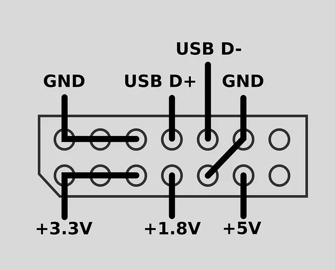
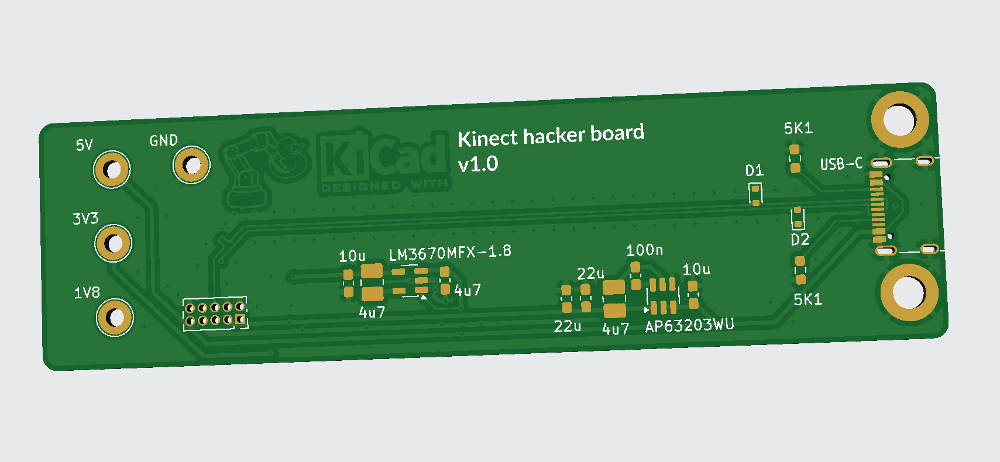

# README.md

## Kinect Lite


## Sources

The original 2019 article: https://medium.com/robotics-weekends/how-to-turn-old-kinect-into-a-compact-usb-powered-rgbd-sensor-f23d58e10eb0 by Weekend Robotics describes tear own, splicing, and setting up the software with libfreenect for ROS1 Melodic



A facebook video by Weekend Robotics: https://www.facebook.com/watch/?v=615250869281835

[Codrinidk](https://www.reddit.com/user/Codrinidk/) in reddit r/robotics in 2023: https://www.reddit.com/r/robotics/comments/18xpa9s/finished_my_kinect_lite_project/ with comments on difficult steps

Case inspired by this STL from Printables: https://www.printables.com/model/229689-kinect-lite

Another case design in FreeCAD available in https://github.com/vojtapl/xbox360-kinect-lite

PCB inspired by this github repo: https://github.com/vojtapl/xbox360-kinect-lite


Kicad friendly PCB manufacturers: https://forum.kicad.info/t/kicad-friendly-pcb-manufacturers/47740

USB-C CAD model from https://www.3dcontentcentral.com/download-model.aspx?catalogid=171&id=1324314

## Case


## Layout



## 3D


## Testing

```bash
$ kinect-3d-view
Waiting for sensor initialization...
Warning: Calibration file [kinect_calib.cfg] not found -> Using default params.
Could not find device sibling
Calling CKinect::initialize()...Exception in Kinect thread: ==== MRPT exception ====
Message:  Error opening Kinect sensor with index: 0
Location: /home/mhered/git/mrpt/libs/hwdrivers/src/CKinect.cpp:370: [void mrpt::hwdrivers::CKinect::open()
Call stack backtrace:
[0 ]     0x7f32408d9bcf 
[1 ]     0x560d5876142c 
[2 ]     0x7f323f4ecdb4 
[3 ]     0x7f323f09caa4 
[4 ]     0x7f323f129c6c 

terminate called without an active exception
Aborted (core dumped)
```

