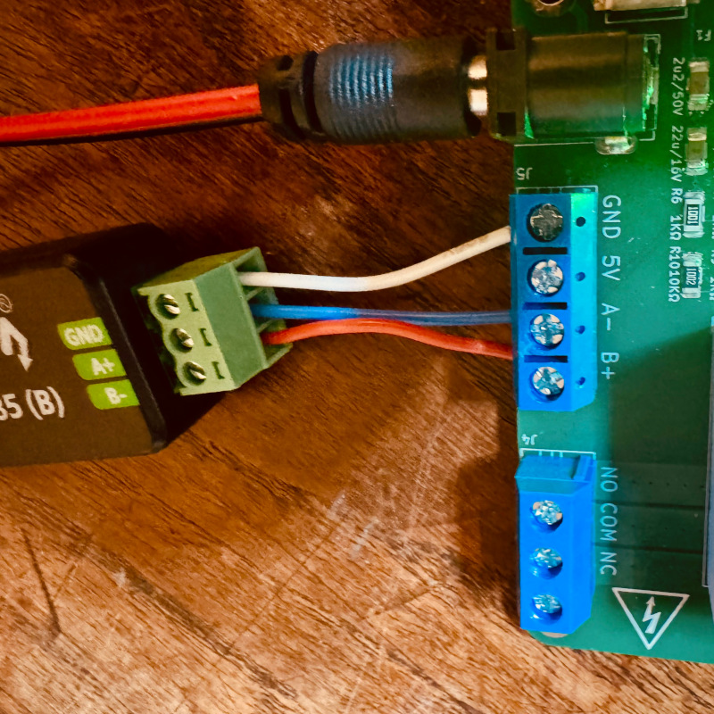
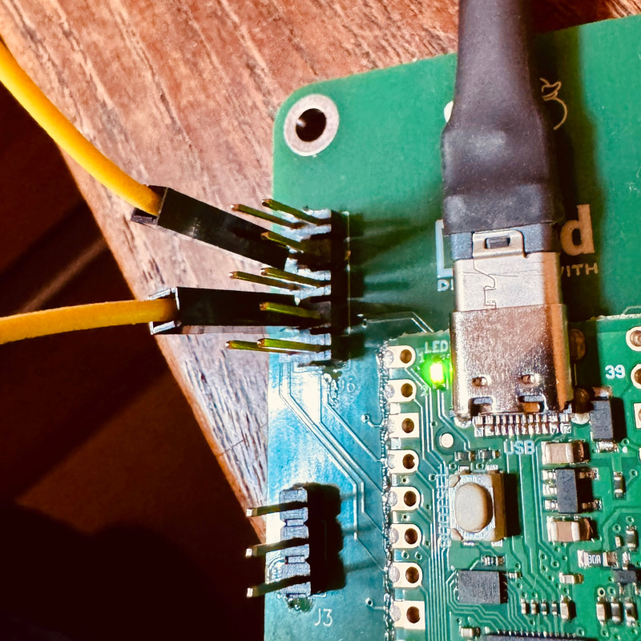

# pico_IoT_thingy — testing Firmware

Simple, single-pass test suite that validates GPIO routing, buses, sensors, and connectors immediately after PCB assembly.

Note: Written with AI then fine-tuned. See [Prompt.md](./Prompt.md) for initial prompt written with ChatGPT and used in Copilot

## Prerequisites

### Install MicroPython firmware

1. **Download the UF2 firmware from [https://micropython.org/download/RPI_PICO_W/](vscode-file://vscode-app/usr/share/code/resources/app/out/vs/code/electron-browser/workbench/workbench.html) **

   Using `RPI_PICO_W-20260406-v1.28.0.uf2`

2. **Connect the Pico in bootloader mode**

   - Connect the USB cable to your PC while holding the **BOOTSEL** button on the Pico 
   - Release **BOOTSEL** — the Pico mounts as a USB drive called `RPI-RP2`

3. **Copy the UF2 file**

   The drive unmounts automatically and the Pico reboots into MicroPython.

4. **Verify**

   Connect to the pico (via `mpremote repl` or Thonny) and you should get a `>>>` Python prompt. Press `Ctrl+X` to exit.

```bash
(pico-iot-thingy-tools) $ uv run mpremote repl
Connected to MicroPython at /dev/ttyACM0
Use Ctrl-] or Ctrl-x to exit this shell

>>> 
```

Note: if needed `RP-008273-DS-3-flash_nuke.uf2` can be used to wipe clean a Pico

### Host-side dependencies

All host tools are declared in `Micropython/pyproject.toml`.
Install them with [uv](https://docs.astral.sh/uv/):

```bash
$ cd Micropython
$ uv sync
```

This creates a virtual environment with:

| Package | Purpose |
|---------|---------|
| `mpremote` | Deploy firmware files to the Pico over USB |
| `pyserial` | RS485 echo helper script |

Prefix every host command in the steps below with `uv run`
(e.g. `uv run mpremote …`) or activate the venv first:

```bash
$ cd projects/06_pico_IoT_thingy/Micropython/
$ source .venv/bin/activate
(pico-iot-thingy-tools) $ 
```

## Preparation

### Step 1 - Configure WiFi credentials

Make a copy of the template secrets file `secrets.example.py` and fill in your WiFi credentials:

```bash
$ cp Micropython/src/config/secrets.example.py Micropython/src/config/secrets.py
```

For security, `secrets.py` is not tracked by git (see `.gitignore`)
Note: if `secrets.py` is absent, the firmware skips WiFi and runs over USB serial only.

### Step 2 - Install the SHT31 library

The SHT31 sensor test uses this `sht31` library by `kfricke`: https://github.com/kfricke/micropython-sht31

The library must be at `src/lib/sht31.py` on the Pico filesystem, if not present, you may download it to host before deploying the firmware with:

```bash
$ curl -o sht31.py https://raw.githubusercontent.com/kfricke/micropython-sht31/master/sht31.py # Download sht31.py from the original repo
```

### Step 3 - Deploy firmware

Deploy the firmware by copying the contents of  `Micropython/src/` to the root filesystem (`/`) of the Pico:

```bash
(pico-iot-thingy-tools) $ uv run mpremote fs cp -r src/. :
```

Contents:

```bash
Micropython/src
├── config
│   ├── board_config.py          # all settings / pin assignments / timeouts
│   ├── secrets.example.py       # template for secrets.py
│   └── secrets.py               # WiFi credentials (NOT tracked by git)
├── lib
│   ├── hardware.py              # peripheral init, RGB/DIP helpers
│   ├── README.md
|   ├── sht31.py                 # sht31 sensor library by kfricke
│   ├── utils.py                 # shared async helpers (button, DIP wait)
│   └── web_server.py            # minimal async HTTP status page
├── main.py                      # entry point
├── run_test.py					 # run single test
└── tests
    ├── test_button.py
    ├── test_dip.py
    ├── test_i2c.py
    ├── test_qwiic.py
    ├── test_relay.py
    ├── test_rgb.py
    ├── test_rs485.py
    ├── test_sht31.py
    └── test_spi.py
```

`Micropython/host` contains PC-side software also needed during the test suite.

### Step 4 - RS485 echo setup

The RS485 test sends a string and expects to receive it back.

Connect a USB to RS485 dongle to the RS485 connector and then to the computer:

- dongle A+ connects to board A-
- dongle B- to board B+



Detecting the ports:

Unplug both devices, plug the dongle first then the Device Under Test (DUT):

```bash
$ sudo dmesg | tail -30
...
[3622621.506344] usb 3-4: new full-speed USB device number 120 using xhci_hcd
[3622621.631091] usb 3-4: New USB device found, idVendor=1a86, idProduct=55d3, bcdDevice= 4.45
[3622621.631106] usb 3-4: New USB device strings: Mfr=0, Product=2, SerialNumber=3
[3622621.631111] usb 3-4: Product: USB Single Serial
[3622621.631115] usb 3-4: SerialNumber: 5A99050115
[3622621.633714] cdc_acm 3-4:1.0: ttyACM0: USB ACM device # this is the dongle
[3622644.953117] usb 3-3: new full-speed USB device number 121 using xhci_hcd
[3622645.079472] usb 3-3: New USB device found, idVendor=2e8a, idProduct=0005, bcdDevice= 1.00
[3622645.079487] usb 3-3: New USB device strings: Mfr=1, Product=2, SerialNumber=3
[3622645.079491] usb 3-3: Product: Board in FS mode
[3622645.079495] usb 3-3: Manufacturer: MicroPython
[3622645.079499] usb 3-3: SerialNumber: 4553306578839bea
[3622645.082299] cdc_acm 3-3:1.0: ttyACM1: USB ACM device # this is the DUT
```

Use `lsusb` to identify the devices:

```bash
$ lsusb
...
Bus 003 Device 120: ID 1a86:55d3 QinHeng Electronics USB Single Serial # USB to RS485 dongle
Bus 003 Device 121: ID 2e8a:0005 MicroPython Board in FS mode # Pico-based custom board, DUT
...
```

* dongle is device 120 on `/dev/ttyACM0`

* DUT is is device 121 on `/dev/ttyACM1`

Run the helper below on a PC connected via USB-RS485 dongle:

```python
# rs485_echo.py  — run on PC
import serial, time

PORT = "/dev/ttyACM0"   # adjust to your port (Windows: "COM3", etc.)
BAUD = 9600

with serial.Serial(PORT, BAUD, timeout=1) as ser:
    print(f"RS485 echo on {PORT} @ {BAUD} baud — Ctrl+C to stop")
    while True:
        data = ser.read(64)
        if data:
            print(f"  Echo: {data!r}")
            ser.write(data)
```

```bash
$ uv run python rs485_echo.py
```

The test string is configurable in `config/board_config.py`:

```json
"rs485": {
    "baudrate": 9600,
    "test_string": "HELLO_RS485\r\n"
}
```

### Step 5 - SPI loopback setup

Short **MOSI (GPIO3, pin 5)** to **MISO (GPIO4, pin 6)** on the SPI connector with a single jumper wire or a loopback jumper on the test jig.  No other external connections are required.



## Running single tests

Use `exec(open('run_test.py').read())` on the REPL

```bash
(pico-iot-thingy-tools) $ uv run mpremote repl
Connected to MicroPython at /dev/ttyACM0
Use Ctrl-] or Ctrl-x to exit this shell

>>> exec(open('run_test.py').read())

Available tests:
  1. rgb
  2. button
  3. dip
  4. i2c
  5. sht31
  6. qwiic
  7. relay
  8. rs485
  9. spi

Press a digit key: 

```

## Running all tests

```bash
(pico-iot-thingy-tools) $ uv run mpremote repl
Connected to MicroPython at /dev/ttyACM0
Use Ctrl-] or Ctrl-x to exit this shell

>>> exec(open('main.py').read())
...
```

If WiFi is configured, the firmware prints the IP address and starts a web server.  Open `http://<IP>` in any browser — the page auto-refreshes every 5 seconds showing live test progress.

## Test sequence

| # | Test | What is validated |
|---|------|-------------------|
| 1 | RGB LED | PWM colour cycle; operator visual confirm |
| 2 | Button | 3× press/release; GPIO12 |
| 3 | DIP switch | 6 patterns; all four switches + GPIO19-22 |
| 4 | I2C scan | SHT31 detected at 0x44 |
| 5 | SHT31 | 5 temp+humidity readings in valid range |
| 6 | QWIIC | New I2C device appears after plug-in |
| 7 | Relay | 3 toggle cycles; operator click/LED confirm |
| 8 | RS485 | UART0 echo via THVD1406 transceiver |
| 9 | SPI | Loopback with MOSI < > MISO jumper |

## Customisation

All pin numbers, I2C/SPI/UART parameters, and timeouts live in `config/board_config.py`.  No other files need editing for routine board revisions.

To skip a test, remove its entry from the `_TESTS` list in `main.py`.

## Known hardware notes

- Relay - The firmware only validates relay activation, not contact polarity.
- The **THVD1406** RS485 transceiver uses auto-direction mode (SHDN and RE tied HIGH).  No DE/RE GPIO control is required.
- RS485 termination resistor jumper J7 may be installed during QC testing without affecting the echo test.

## Open Issues

- [ ] RS845 not passing. Tx works but Rx does not. INVESTIGATE

