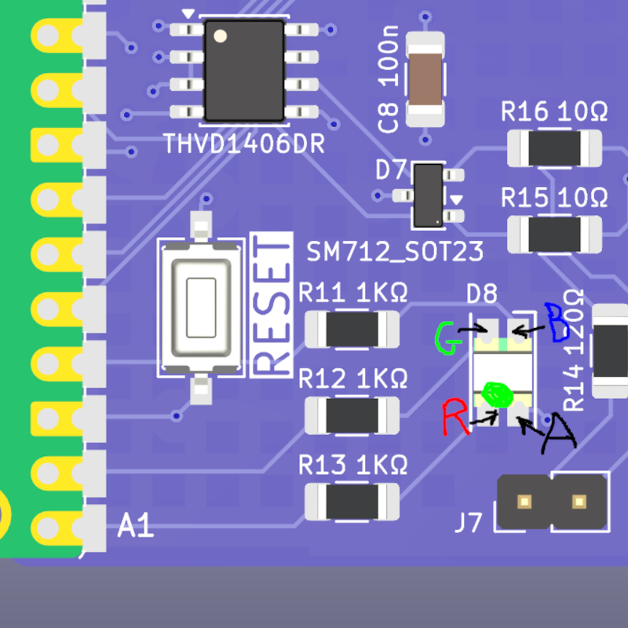
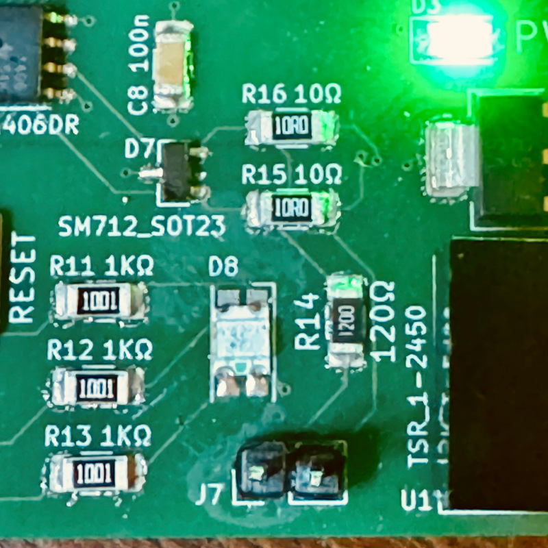

# README.md

[TOC]

Design of a Raspberry PICO IoT device on 4-layer PCB with sensors and more. Ref. https://www.youtube.com/watch?v=tCulctQqdhM by morten

Features:

* Raspberry Pi Pico (W)
* RS485 / MOD-bus interface
*  DIP-switch for MOD-bus address selection 
* SHT31-DIS high precision temperature and humidity sensor. I used P version (with protective film for reflow)
* QWIIC connector 
* Reset Button  
* User Button 
* User RGB LED 
* 2x5 pin SPI bus expansion header   
* Power relay (230V - 16A)      
* Wide range input voltage +8V to 24V DC 

For the mechanical side of things:

* 4-layer board design
* Size 80x80mm
* 4 x 3.2mm mounting holes 

## My notes on components

TRACO Power TSR-1 2450 - DC-DC step-down (buck) regulator (replaces 78xx linear regulators) with a single 5V output at up to 1A

DC power jack > takes nominal 12V but accepts a wide range of input voltage

1A polyfuse to protect input - 1.1A hold current polyfuse > selected MF-R110 (TH) / MF-SM100-2 (SMT)

diode 24V tranzorb (used **SMAJ24A**)

3.3V bar: 

* Check out this guide [Hardware design with RP2040](https://pip-assets.raspberrypi.com/categories/814-rp2040/documents/RP-008279-DS-1-hardware-design-with-rp2040.pdf)  guide ([local copy](./assets/RP-008279-DS-1-hardware-design-with-rp2040.pdf))
* LDO for 3.3.V - TLV1117-33IDCYR 800mA Low-Dropout Linear Regulator, 3.3V fixed output, SOT-223-4

Pico W:

* 1N5819 40V 1A Schottky Barrier Rectifier Diode, DO-41 to protect Vin > replaced by **SS14** iaw ChatGPT the **SS14** is a standard SMD analog (same **1 A / 40 V** rating in a DO-214AC package)

Relay:

* diode in reverse: LL4148 > replaced by **SS14**

Transceiver: THVD1406DR transceiver (made custom symbol) instead of MAX3485 

## Schematics

Screw terminal model from here: https://grabcad.com/library/pcb-mount-screw-terminal-block-connectors-1 converted to STEP using Onshape (spam, nonstd pwd).

Why is he using 4 wires for RS485? See: https://www.seeedstudio.com/blog/2021/03/18/how-rs485-works-and-how-to-implement-rs485-into-industrial-control-systems/

Initial placement of components (before routing):

## v1.2

first proto sent to production

Known issues:

* silkscreen missing connector labels, project name and version

## Testing the first proto (v1.2)

Test sequence

1.  To power up, connect input to Jack (12VDC nominal, 6.5-36VDC allowed)
    * PWR LED lights up (GREEN)
    * check 5V between GND and 5V
    * check 3.3v between GND and 3V3

2.  Flash micropython using SWD

3.  upload scripts using RS485

4.  run full test suite: [pico_IoT_thingy — testing Firmware](./Micropython/README.md)

### Notes on implementation

I had to do some research to understand the design in detail in order to write testing firmware. Below are my notes on implementation and the findings after conducting testing of the first proto (v1.2)

#### Pico W pinout

Reference needed to address pins via software

#### SWD connector (J3)

Exposes the DEBUG interface of the Pico. It allows flashing micropython but it is not practical to upload firmware:

* SWCLK

* SWDIO

* GND 

**TO DO:** 

- [ ] **test SWD connector for flashing firmware (not yet tested, so far flashing done over USB)**

#### Relay

When Pin 15 (GPIO11) (/RELAY net) is set to HIGH:

- the 16A 250VAC relay switches
- the yellow LED (**D5**) labelled **OUT** lights up

Findings during testing:

- Relay **NO** and **NC** pins are labelled incorrectly -> need to be swapped

- YELLOW LED **D5** was powering up but relay did not work > confirmed  that the circuit in v1.2 was designed for the monostable (non latching) version of the relay (Ref. RT314005) but the reference used was a bistable realy (Ref. RT314A05) so it could not work. A bistable would require an H-bridge to reverse polarity (!!). Replaced the RT314A05 in the proto and confirmed the board works well with the correct relay RT314005.

**TO DO:**

- [ ] **Swap incorrect NO and NC labels in future version** 
- [ ] **Update RT314005 symbol and footprint in future version**

#### User-programmable button

Pressing the button sets GPIO13 (/SW net) HIGH. This button was used as primary user input in testing firmware.

#### Reset button

 Pressing the button sets Pin 30 (/RUN net) LOW and resets the Pico

Not yet tested.

**TO DO:**

- [ ] **Test RESET button** 

#### User RGB LED

Findings: 

* Board v1.2 assumed an RGB LED (**D8**) of **RGBA** LED type. The actual component I have was of **BGRA** type, with the following pinout:

  - LED Pin 1 is BLUE

  - LED Pin 2 is GREEN

  - LED Pin3 is RED

  - LED Pin 4 is ANODE

  Consequently pin assignments were updated via firmware:

  * Pin 21 (GPIO16 -> RED 
  * Pin 22 (GPIO17) -> GREEN 
  * Pin 24 (GPIO18) -> BLUE

  Note these pins do not need to be ADC, PWM can be used to smoothly control LED color 

- Note: RGB LED (**D8**) should be installed such that the green mark is pointing downwards, see images. During testing of the proto it was found incorrectly installed (rotated 180 degrees), resulting in BLUE and RED colors swapped and GREEN color dead -> Fixed in the proto. 

|  |  |
| ------------------------------------------------------------ | ------------------------------------------------------------ |

**TO DO:**

- [x] **In future version update D8 symbol and nets / pin assignments as follows:** 
  * **GPIO16 (pin 21) -> RGB LED_R** 
  * **GPIO17 (pin 22) -> RGB LED_G** 
  * **GPIO18 (pin 24) -> RGB LED_B** 

#### RS485 transceiver and connector

RS485 transceiver (ref THVD1406DR ) **IC1** connects to the UART interface of Pico W:

* Pin 1 (GPI00 / UART0_TX) -> D

* Pin 2 (GPI01 / UART0_RX) -> R

Note: SHDN and RE are together set to HIGH which iaw the datasheet of the THVD1406DR transceiver enables Auto-direction mode which allows controlling driver and receiver using the data input pin D 

Questions: 

- PRELIMINARY ANSWERS: What is **J7** connector?  A jumper to activate the 120R resistor connecting A and B. Is this the termination resistor? Probably yes. How does it alter behaviour of RS485 connector? Should be installed only if this component is at the end of the line.
- what is the MOD-bus address selected with the DIP switch for? How does the RS485 transceiver know ?

Findings during testing:

* Connecting to RS485 dongle:

  - dongle A+ connects to board **A-**

  - dongle B- to board **B+**

**TO DO:** 

- [ ] **Review RS485 labels (A+ or - / B+ or -) to avoid confusion**
- [ ] **Replace J5 RS485 connector: use 4-pin 2.54mm pitch screw terminal instead of 5mm pitch**
- [ ] **test MOD-bus address selection with the DIP switch and RS485 protocol**
- [ ] **Expose UART: Not having UART exposed makes it difficult to upload software on the Pico. Hacked it shaving off the rubber from a microUSB connector to connect directly the Pico to PC via USB.**

#### DIP switch

* GPIO19 -> DIP4
* GPIO20 -> DIP3
* GPIO21 -> DIP2
* GPIO22 -> DIP1

**TO DO:** 

- [ ] **Question: which way is 1 / 0 ?**

#### SPI connector (J6)

* Pin 4 (GPI02 / SPI0_SCK) labelled **SCK**
* Pin 5 (GPI03 / SPI0_TX) MOSI labelled 
* Pin 6 (GPI04 / SPI0_RX) MISO labelled  
* Pin 7 (GPI05 / SPI0_CSn) labelled **CS**

Also exposed: 3V3, GND, ADC0/GPIO26 and ADC1/GPIO27

**TO DO:** 

- [ ] **Test SPI communication with PC, current firmware only checks loop between Tx and Rx**

#### I2C interface

I2C temperature sensor SHT31 (**U2**) and QWIIC connector **J2** connect to PicoW via I2C interface:

* SDA: Pin 9 (GPI06 / I2C1_SDA)
* SCL: Pin 10 (GPI07 / I2C1_SCL)

#### Resistor (R5)

Leave **R5** 0Ohm resistor unpopulated so Pico W will not power the 3V3 bar

If R5 is populated Pico W powers the 3V3 bar and may drive too much current (not tested)

#### Wifi

Findings:

Wifi was not working on USB-C Pico W. Replaced to check if it was a faulty unit or a fake component 

- "fake component" (Pico W wih USB-C connector) does not have CYW43 but an ESP instead, does not work with std libraries, requires low level syntax.
- additionally the first Fake Pico W was apparently faulty. 

**TO DO:** 

- [ ] **update firmware to output logging to web server / webrepl**
- [ ] **confirm if first Fake Pico W is faulty**

## v1.4 (WIP)

Tests pending:

- [ ] test RESET button
- [ ] test flashing via SWD
- [ ] test SPI comms
- [ ] test MOD-bus address selection with the DIP switch and RS485 protocol / which way is 1 / 0 ?
- [ ] update firmware to output logging to web server / webrepl
- [ ] confirm if first Fake Pico W is faulty

Fixes:

- [x] Update silkscreen to add missing labels: connector pinout (SWD, SPI, RS485), 12V nominal input voltage, project name and version
- [x] Swap incorrect **NO** and **NC** labels for relay 
- [ ] Review RS485 labels (A+ or - / B+ or -) to avoid confusion
- [ ] Replace RT314A05 symbol and footprint by RT314005
- [x] update RGB LED D8 symbol and nets / pin assignments for BGRA type as follows:
  * GPIO16 (pin 21) -> RGB LED_R 
  * GPIO17 (pin 22) -> RGB LED_G 
  * GPIO18 (pin 24) -> RGB LED_B
- [ ] Consider moving the PicoW footprint to avoid the clash with the USB connector  
- [ ] Replace J5 RS485 connector: use 4-pin 2.54mm pitch screw terminal instead of 5mm pitch
- [ ] Expose UART: Not having UART exposed makes it difficult to upload software on the Pico. Hacked it shaving off the rubber from a microUSB connector to connect directly the Pico to PC via USB.

