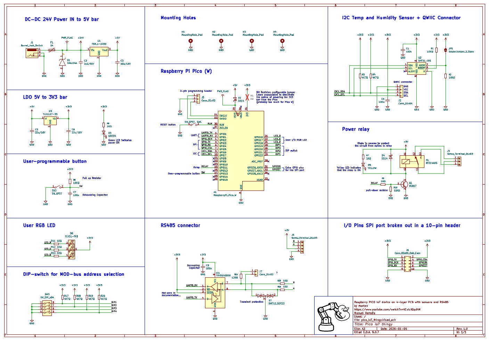
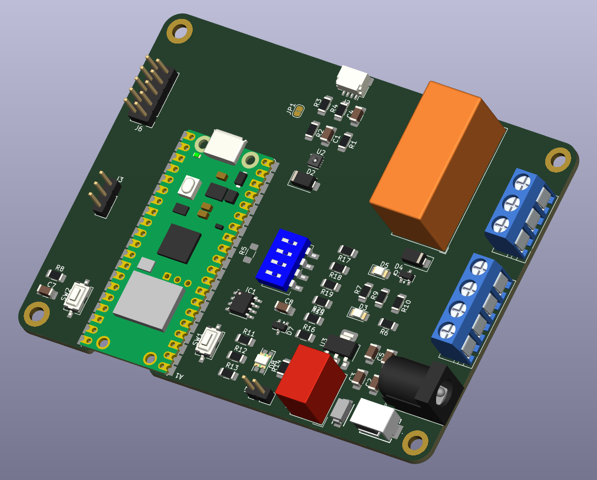
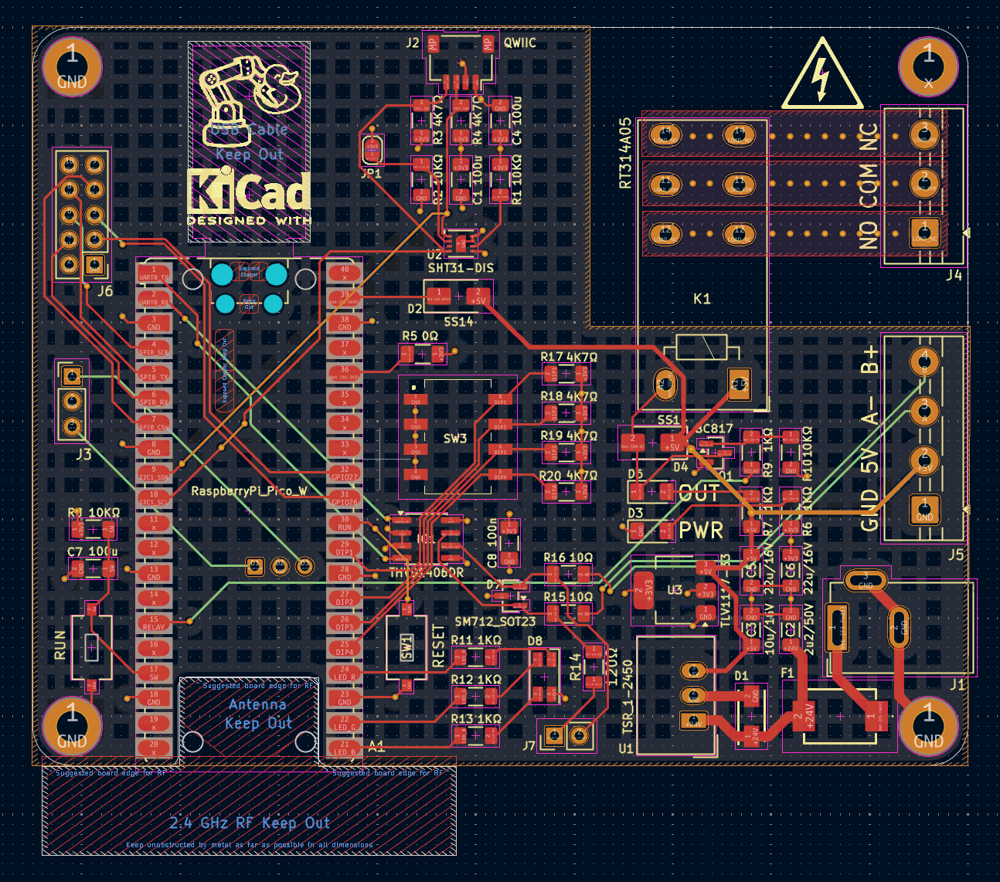
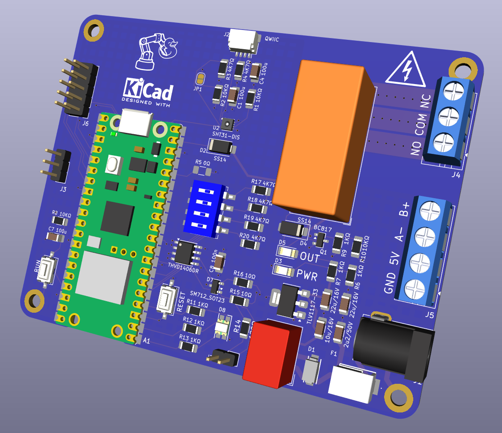

# README.md

Design of a Raspberry PICO IoT device on 4-layer PCB with sensors and more. Ref. https://www.youtube.com/watch?v=tCulctQqdhM by morten

Features:

* Raspberry Pi Pico (W)
* RS485 / MOD-bus interface
*  DIP-switch for MOD-bus address selection 
* SHT31-DIS high precision temperature and humidity sensor. I use P version (with protective film for reflow)
* QWIIC connector 
* Reset Button  
* User Button 
* User RGB LED 
* 2x5 pin SPI bus expansion header   
* Power relay (230V - 16A)      
* Wide range input voltage +8V to 24V DC 

For the mechanical side of things:

* 4-layer board design
* Size 80x80mm
* 4 x 3.2mm mounting holes 

## Notes on components

TRACO Power TSR-1 2450 - DC-DC step-down (buck) regulator (replaces 78xx linear regulators) with a single 5V output at up to 1A

DC power jack

1A polyfuse to protect input - 1.1A hold current polyfuse > selected MF-R110 (TH) / MF-SM100-2 (SMT)

diode 24V tranzorb (used SMAJ24A)

3.3V bar: 

* Check out this [hardware design with RP2040](https://pip-assets.raspberrypi.com/categories/814-rp2040/documents/RP-008279-DS-1-hardware-design-with-rp2040.pdf)  guide ([local copy](./assets/RP-008279-DS-1-hardware-design-with-rp2040.pdf))
* LDO for 3.3.V - TLV1117-33IDCYR 800mA Low-Dropout Linear Regulator, 3.3V fixed output, SOT-223-4

Pico:

* 1N5819 40V 1A Schottky Barrier Rectifier Diode, DO-41 to protect Vin. iaw ChatGPT a standard SMD analog is the **SS14** series — same **1 A / 40 V** rating in a **DO-214AC (SMA) package**

Relay:

* diode in reverse: LL4148 > replaced by SS14

Transceiver: THVD1406DR transceiver (made custom symbol) instead of MAX3485 but now I am not sure I am wiring it properly!

# Schematics

Screw terminal model from here: https://grabcad.com/library/pcb-mount-screw-terminal-block-connectors-1 converted to STEP using Onshape (spam, nonstd pwd).

Why is he using 4 wires for RS485? See: https://www.seeedstudio.com/blog/2021/03/18/how-rs485-works-and-how-to-implement-rs485-into-industrial-control-systems/

Initial placement of components (before routing):

## v1.2

first proto sent to production

Issues:

* silkscreen missing connector labels, project name and version

## v1.4

Fixes:

- silkscreen: add missing connector labels, project name and version
- Relay is wired as if it was monostable (non latching) but RT314A05 relay is actually bistable, would require an H-bridge to reverse polarity (!!). The correct relay to work with this circuit should be the RT314005 instead. 
- Additionally relay's NO and NC labels are swapped (confirmed after the proper relay is installed) 
- **Note: D8 LED green mark should point downwards. If orientation is incorrect during tests: BLUE and RED appear swapped and GREEN appears dead**
- what is **J7** connector > Seems to be a jumper to enable a 120 Ohm termination resistor for RS485 connector

Open Issues:

- [ ] Wifi not working on USB-C Pico W. Replace to check if it was a faulty unit or a fake component > "fake component" does not have CYW43 but an ESP instead, does not work with std libraries. Additionally the first Fake Pico W seems was faulty.
- [x] Install the RT314005 relay, check behavior, and after check again if **NO** and **NC** labels are indeed swapped. Confirmed the monostable relay works ok, and NC / NO are indeed swapped
- [x] Pico USB-C connector is too close to the board, normal connectors wont fit, had to manufacture  an extra flat one. Consider moving the footprint to avoid the clash. > hacked shaving off the rubber from the microUSB connector to make it flatter
- [ ] replace J5 RS485 connector: 4pin 5mm pitch screw terminal by 2.54mm pitch
